# SOFTWARE ARCHITECTURE — WEBSITE LANDING PAGE + ADMIN DASHBOARD TRƯỜNG THPT

> Tài liệu kiến trúc hệ thống cho website trường THPT gồm **Landing Page public**, **Admin Dashboard**, **API backend**, **database**, **file storage**, **email/webhook**, **tracking** và **bảo mật tài khoản admin**.

---

## 1. Mục tiêu kiến trúc

Hệ thống cần đáp ứng các mục tiêu kỹ thuật:

- Public landing page tải nhanh, SEO tốt, responsive.
- Admin dashboard bảo mật, phân quyền rõ ràng.
- Backend API rõ ràng, dễ mở rộng.
- Quản lý lead tuyển sinh có trạng thái, lịch sử chăm sóc và lịch hẹn.
- CMS nội dung linh hoạt cho banner, tin tức, FAQ, gallery, giáo viên, chương trình đào tạo.
- Hỗ trợ email/webhook để thông báo lead và tích hợp CRM/Zalo/Telegram.
- Có audit log cho thao tác admin quan trọng.
- Có khả năng triển khai Docker/cloud và mở rộng sau này.

---

## 2. Kiến trúc tổng thể

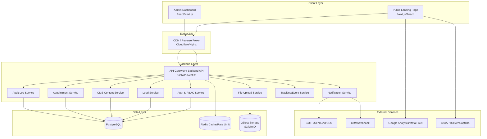

---

## 3. Tech Stack đề xuất

### 3.1 Frontend

| Thành phần | Đề xuất |
|---|---|
| Framework | Next.js hoặc React + Vite |
| Styling | Tailwind CSS |
| Form | React Hook Form + Zod |
| State/query | TanStack Query |
| Table admin | TanStack Table |
| Chart | Recharts / ECharts |
| Calendar | FullCalendar / React Big Calendar |
| Rich text editor | TipTap / Lexical / CKEditor |
| Upload | Uppy / custom upload component |

### 3.2 Backend

Có thể chọn 1 trong 2 hướng:

| Option | Stack | Phù hợp |
|---|---|---|
| Python | FastAPI + SQLAlchemy + Alembic | Team Python, API nhanh, dễ tích hợp AI/automation |
| Node.js | NestJS + Prisma/TypeORM | Team TypeScript fullstack, structure enterprise tốt |

### 3.3 Database & Infrastructure

| Thành phần | Đề xuất |
|---|---|
| Database | PostgreSQL |
| Cache/rate limit | Redis |
| Object storage | S3/MinIO |
| Reverse proxy | Nginx / Cloudflare |
| Container | Docker, Docker Compose |
| CI/CD | GitHub Actions / GitLab CI |
| Monitoring | Grafana/Prometheus hoặc cloud logs |

---

## 4. Deployment Architecture

### 4.1 Môi trường tối thiểu

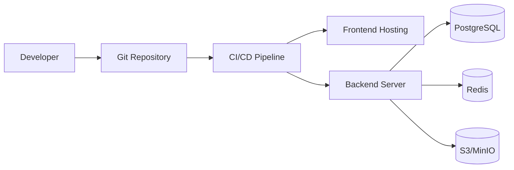

### 4.2 Môi trường đề xuất

| Môi trường | Mục đích |
|---|---|
| Local | Dev cá nhân |
| Staging | Test/UAT nội bộ trường |
| Production | Người dùng thật |

### 4.3 Domain gợi ý

| App | URL ví dụ |
|---|---|
| Public Landing Page | `https://school.edu.vn` |
| Admin Dashboard | `https://school.edu.vn/admin` hoặc `https://admin.school.edu.vn` |
| API | `https://api.school.edu.vn` |
| File CDN | `https://cdn.school.edu.vn` |

---

## 5. Frontend Architecture

### 5.1 Public Landing Page

Public page nên ưu tiên SEO và performance. Nếu dùng Next.js, có thể dùng SSG/ISR cho nội dung CMS.

**Các route:**

| Route | Mục đích |
|---|---|
| `/` | Landing page chính |
| `/tin-tuc` | Danh sách tin tức nếu tách riêng |
| `/tin-tuc/[slug]` | Chi tiết bài viết |
| `/chinh-sach-bao-mat` | Chính sách bảo mật |

**Section components:**

```txt
Header
HeroBanner
AboutSection
WhyChooseUsSection
ProgramsSection
AchievementsSection
FacilitiesGallery
TeachersSection
StudentLifeSection
AdmissionProcessSection
NewsSection
TestimonialsSection
AdmissionForm
FAQSection
Footer
```

### 5.2 Admin Dashboard

**Route gợi ý:**

| Route | Màn hình |
|---|---|
| `/admin/login` | Đăng nhập |
| `/admin/forgot-password` | Quên mật khẩu |
| `/admin/reset-password` | Đặt lại mật khẩu |
| `/admin/activate-account` | Kích hoạt tài khoản |
| `/admin/dashboard` | Dashboard tổng quan |
| `/admin/leads` | Danh sách lead |
| `/admin/leads/[id]` | Chi tiết lead |
| `/admin/appointments` | Lịch hẹn |
| `/admin/news` | Quản lý tin tức |
| `/admin/banners` | Quản lý banner |
| `/admin/programs` | Quản lý chương trình đào tạo |
| `/admin/teachers` | Quản lý giáo viên |
| `/admin/gallery` | Quản lý gallery |
| `/admin/faqs` | Quản lý FAQ |
| `/admin/testimonials` | Quản lý testimonial |
| `/admin/admission-info` | Thông tin tuyển sinh |
| `/admin/users` | Quản lý user |
| `/admin/settings` | Cấu hình hệ thống |
| `/admin/audit-logs` | Nhật ký hoạt động |

### 5.3 FE Folder Structure gợi ý

```txt
src/
  app/
    public routes...
    admin routes...
  components/
    common/
    public/
    admin/
    forms/
    tables/
  features/
    auth/
    leads/
    appointments/
    content/
    users/
    settings/
  hooks/
  lib/
    api-client.ts
    auth.ts
    validation.ts
  types/
  constants/
```

### 5.4 UI State bắt buộc

- Loading state.
- Empty state.
- Error state.
- Success toast.
- Confirm delete modal.
- Create/edit form.
- Detail drawer.
- Filter panel.
- Pagination.
- Bulk action bar.
- Upload progress.

---

## 6. Backend Architecture

### 6.1 Backend module

| Module | Trách nhiệm |
|---|---|
| Auth Module | Login, logout, token, activation, reset password, change password |
| RBAC Module | Role, permission, access control |
| Lead Module | CRUD lead, status, assignment, notes, timeline |
| Appointment Module | Lịch hẹn tư vấn/tham quan |
| CMS Module | News, banner, program, teacher, gallery, FAQ, testimonial |
| File Module | Upload ảnh/file, validate, lưu object storage |
| Notification Module | Email, webhook CRM/Zalo/Telegram |
| Settings Module | Thông tin trường, SMTP, webhook, tracking |
| Audit Module | Ghi log thao tác admin |
| Tracking Module | Nhận event public/admin nếu cần server-side tracking |

### 6.2 Backend Folder Structure — FastAPI gợi ý

```txt
app/
  main.py
  api/
    v1/
      auth.py
      leads.py
      appointments.py
      content.py
      users.py
      settings.py
      audit_logs.py
      files.py
  core/
    config.py
    security.py
    permissions.py
    rate_limit.py
  models/
  schemas/
  services/
  repositories/
  workers/
  integrations/
    email.py
    webhook.py
  db/
    session.py
    migrations/
  tests/
```

### 6.3 Backend Folder Structure — NestJS gợi ý

```txt
src/
  main.ts
  modules/
    auth/
    rbac/
    leads/
    appointments/
    content/
    users/
    settings/
    audit-logs/
    files/
    notifications/
  common/
    guards/
    decorators/
    pipes/
    filters/
  database/
  integrations/
  tests/
```

---

## 7. Domain Model

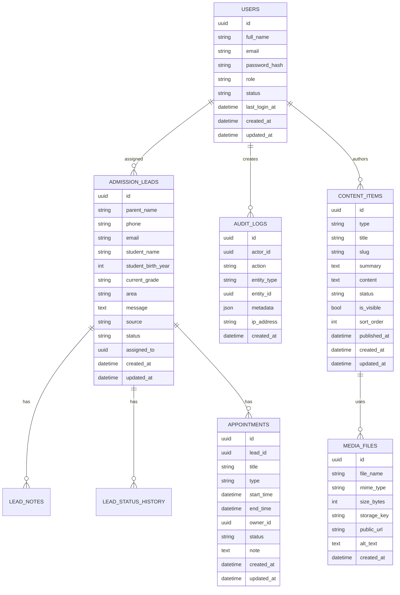

---

## 8. Database Design đề xuất

### 8.1 users

| Column | Type | Note |
|---|---|---|
| id | uuid | PK |
| full_name | varchar | Họ tên |
| email | varchar unique | Email đăng nhập |
| password_hash | varchar | Hash password |
| role | varchar | SUPER_ADMIN/ADMIN/ADMISSION/CONSULTANT/EDITOR/VIEWER |
| status | varchar | PENDING_ACTIVATION/ACTIVE/LOCKED/DISABLED/PASSWORD_RESET_REQUIRED |
| last_login_at | timestamptz | Lần đăng nhập cuối |
| created_at | timestamptz |  |
| updated_at | timestamptz |  |

### 8.2 auth_tokens

Dùng cho activation/reset password/refresh token nếu cần.

| Column | Type | Note |
|---|---|---|
| id | uuid | PK |
| user_id | uuid | FK users |
| token_hash | varchar | Không lưu raw token |
| type | varchar | ACTIVATION/RESET_PASSWORD/REFRESH |
| expires_at | timestamptz | Thời hạn |
| used_at | timestamptz | Đã dùng |
| created_at | timestamptz |  |

### 8.3 admission_leads

| Column | Type | Note |
|---|---|---|
| id | uuid | PK |
| parent_name | varchar | Required |
| phone | varchar | Required |
| email | varchar | Optional |
| student_name | varchar | Required |
| student_birth_year | int | Optional |
| current_grade | varchar | Required |
| area | varchar | Optional |
| message | text | Optional |
| source | varchar | Website/Facebook/Zalo/... |
| status | varchar | NEW/CONTACTED/CALL_BACK/... |
| assigned_to | uuid | FK users |
| created_at | timestamptz |  |
| updated_at | timestamptz |  |

### 8.4 lead_notes

| Column | Type | Note |
|---|---|---|
| id | uuid | PK |
| lead_id | uuid | FK admission_leads |
| author_id | uuid | FK users |
| note | text | Nội dung ghi chú |
| created_at | timestamptz |  |

### 8.5 lead_status_history

| Column | Type | Note |
|---|---|---|
| id | uuid | PK |
| lead_id | uuid | FK |
| from_status | varchar |  |
| to_status | varchar |  |
| changed_by | uuid | FK users |
| note | text | Optional |
| created_at | timestamptz |  |

### 8.6 appointments

| Column | Type | Note |
|---|---|---|
| id | uuid | PK |
| lead_id | uuid | FK admission_leads |
| title | varchar |  |
| type | varchar | CALL/VISIT/ONLINE |
| start_time | timestamptz |  |
| end_time | timestamptz |  |
| owner_id | uuid | FK users |
| status | varchar | SCHEDULED/COMPLETED/CANCELLED/NO_SHOW |
| note | text | Optional |
| created_at | timestamptz |  |
| updated_at | timestamptz |  |

### 8.7 content_items

| Column | Type | Note |
|---|---|---|
| id | uuid | PK |
| type | varchar | NEWS/BANNER/PROGRAM/TEACHER/GALLERY/FAQ/TESTIMONIAL/ADMISSION_INFO |
| title | varchar |  |
| slug | varchar | Unique nullable |
| summary | text |  |
| content | text/jsonb | Rich content |
| metadata | jsonb | Linh hoạt theo từng type |
| status | varchar | DRAFT/PUBLISHED/ARCHIVED |
| is_visible | boolean |  |
| sort_order | int |  |
| published_at | timestamptz |  |
| created_by | uuid | FK users |
| updated_by | uuid | FK users |
| created_at | timestamptz |  |
| updated_at | timestamptz |  |

### 8.8 media_files

| Column | Type | Note |
|---|---|---|
| id | uuid | PK |
| file_name | varchar |  |
| mime_type | varchar |  |
| size_bytes | bigint |  |
| storage_key | varchar | Path object storage |
| public_url | varchar | CDN URL |
| alt_text | text | SEO/accessibility |
| created_by | uuid | FK users |
| created_at | timestamptz |  |

### 8.9 settings

| Column | Type | Note |
|---|---|---|
| key | varchar | PK |
| value | jsonb | Config value |
| updated_by | uuid | FK users |
| updated_at | timestamptz |  |

### 8.10 audit_logs

| Column | Type | Note |
|---|---|---|
| id | uuid | PK |
| actor_id | uuid | FK users |
| action | varchar | CREATE/UPDATE/DELETE/LOGIN/RESET_PASSWORD/... |
| entity_type | varchar | LEAD/USER/CONTENT/... |
| entity_id | uuid | Nullable |
| metadata | jsonb | Before/after hoặc chi tiết thao tác |
| ip_address | varchar |  |
| user_agent | text |  |
| created_at | timestamptz |  |

---

## 9. API Design

### 9.1 Chuẩn chung

- Prefix API: `/api`.
- Admin API: `/api/admin/*`.
- Public API: `/api/public/*`.
- Response JSON thống nhất.
- Có pagination với list API.
- Có filter/search/sort cho admin table.
- Có error code rõ ràng.

### 9.2 Response format đề xuất

Success:

```json
{
  "success": true,
  "data": {},
  "message": "Success"
}
```

Error:

```json
{
  "success": false,
  "error": {
    "code": "VALIDATION_ERROR",
    "message": "Dữ liệu không hợp lệ",
    "details": []
  }
}
```

Paginated response:

```json
{
  "success": true,
  "data": {
    "items": [],
    "page": 1,
    "pageSize": 20,
    "total": 100,
    "totalPages": 5
  }
}
```

### 9.3 Public API

#### Submit admission lead

```http
POST /api/admission-leads
```

Request:

```json
{
  "parentName": "Nguyễn Văn A",
  "phone": "0987654321",
  "email": "parent@example.com",
  "studentName": "Nguyễn Văn B",
  "studentBirthYear": 2011,
  "currentGrade": "Lớp 9",
  "area": "Hà Nội",
  "message": "Muốn tư vấn tuyển sinh lớp 10",
  "source": "Website",
  "privacyAccepted": true
}
```

#### Get homepage content

```http
GET /api/public/homepage
```

#### Get news list

```http
GET /api/public/news?limit=6&page=1
```

#### Get news detail

```http
GET /api/public/news/{slug}
```

#### Get FAQ

```http
GET /api/public/faqs
```

### 9.4 Admin Auth API

```http
POST /api/admin/auth/login
POST /api/admin/auth/logout
POST /api/admin/auth/refresh-token
POST /api/admin/auth/change-password
POST /api/admin/auth/forgot-password
POST /api/admin/auth/reset-password
POST /api/admin/auth/activate-account
```

### 9.5 Admin Lead API

```http
GET    /api/admin/leads
POST   /api/admin/leads
GET    /api/admin/leads/{id}
PATCH  /api/admin/leads/{id}
DELETE /api/admin/leads/{id}
POST   /api/admin/leads/{id}/notes
GET    /api/admin/leads/{id}/timeline
POST   /api/admin/leads/bulk-assign
POST   /api/admin/leads/bulk-update-status
GET    /api/admin/leads/export
```

### 9.6 Admin Appointment API

```http
GET    /api/admin/appointments
POST   /api/admin/appointments
GET    /api/admin/appointments/{id}
PATCH  /api/admin/appointments/{id}
DELETE /api/admin/appointments/{id}
```

### 9.7 Admin CMS API

```http
GET    /api/admin/content/{type}
POST   /api/admin/content/{type}
GET    /api/admin/content/{type}/{id}
PATCH  /api/admin/content/{type}/{id}
DELETE /api/admin/content/{type}/{id}
POST   /api/admin/content/{type}/{id}/publish
POST   /api/admin/content/{type}/{id}/archive
```

### 9.8 Admin User API

```http
GET    /api/admin/users
POST   /api/admin/users
GET    /api/admin/users/{id}
PATCH  /api/admin/users/{id}
POST   /api/admin/users/{id}/lock
POST   /api/admin/users/{id}/unlock
POST   /api/admin/users/{id}/disable
POST   /api/admin/users/{id}/send-activation
POST   /api/admin/users/{id}/send-reset-password
```

---

## 10. Authentication & Authorization

### 10.1 Auth Flow

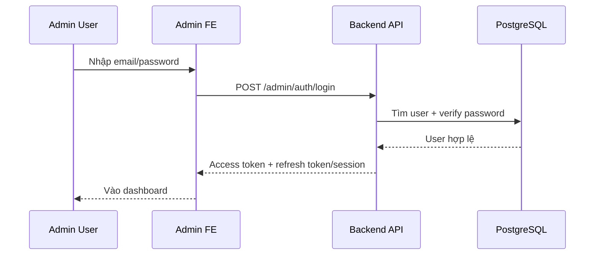

### 10.2 Account Activation Flow

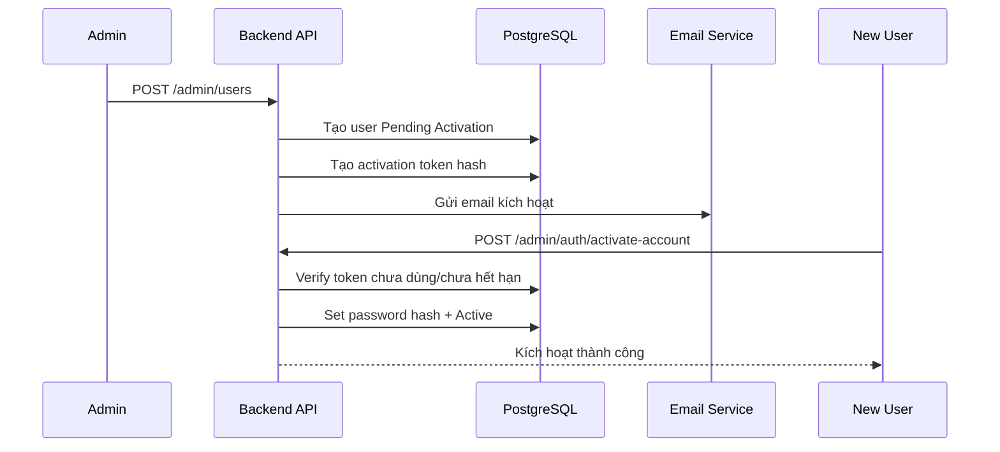

### 10.3 Password Reset Flow

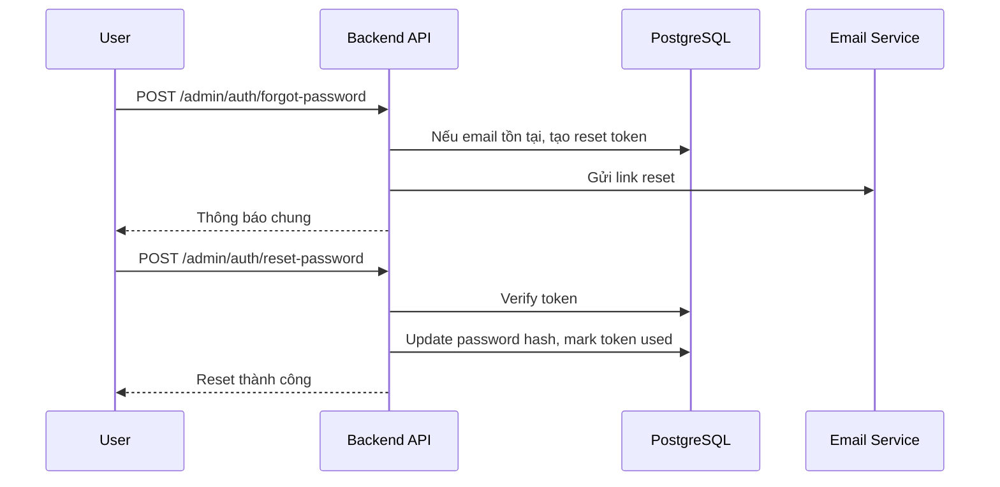

### 10.4 RBAC

Mỗi API admin cần kiểm tra:

1. User đã xác thực chưa.
2. User có status `ACTIVE` không.
3. User có permission trên module/action không.
4. Với Consultant, chỉ được thao tác lead/lịch hẹn được assign.

---

## 11. Lead State Machine

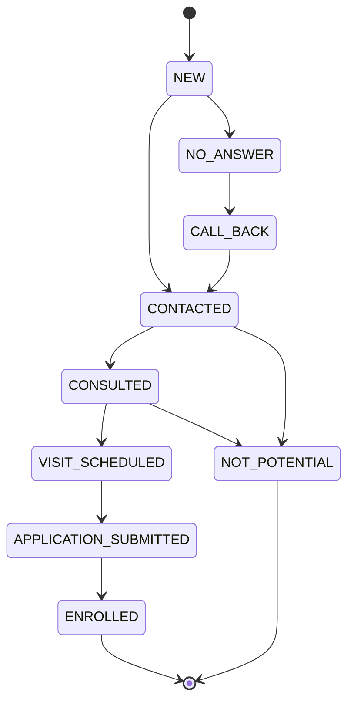

| State | Ý nghĩa |
|---|---|
| NEW | Lead mới |
| CONTACTED | Đã liên hệ |
| NO_ANSWER | Không nghe máy |
| CALL_BACK | Cần gọi lại |
| CONSULTED | Đã tư vấn |
| VISIT_SCHEDULED | Đã đặt lịch tham quan |
| APPLICATION_SUBMITTED | Đã nộp hồ sơ |
| ENROLLED | Đã nhập học |
| NOT_POTENTIAL | Không tiềm năng |

---

## 12. Notification Architecture

### 12.1 Trigger notification

| Trigger | Channel |
|---|---|
| Lead mới | Email nội bộ, webhook CRM/Zalo/Telegram |
| Lịch hẹn sắp tới | Email/popup admin nếu có |
| User được mời | Email activation |
| Quên mật khẩu | Email reset password |
| Admin reset mật khẩu user | Email reset password |

### 12.2 Notification flow

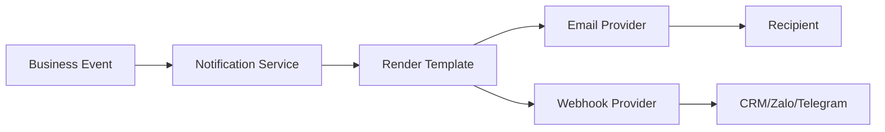

### 12.3 Lưu ý

- Nên xử lý notification async qua queue/job nếu traffic tăng.
- Log trạng thái gửi email/webhook để debug.
- Template email nên tách riêng theo loại.

---

## 13. File Upload Architecture

### 13.1 Loại file

| Loại | Module |
|---|---|
| Ảnh banner | Banner |
| Thumbnail bài viết | News |
| Ảnh giáo viên | Teacher |
| Ảnh gallery | Gallery |
| Brochure PDF | Admission Info |

### 13.2 Quy tắc upload

- Validate mime type.
- Giới hạn dung lượng.
- Generate storage key tránh trùng.
- Lưu metadata vào DB.
- Trả về public URL/CDN URL.
- Có alt text cho ảnh public.

### 13.3 Upload flow

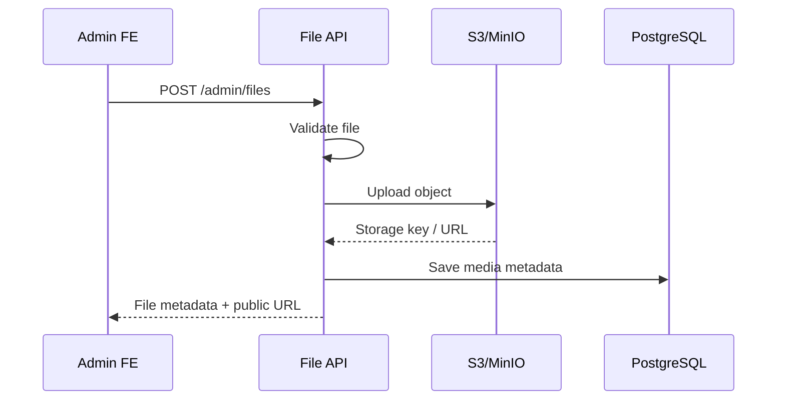

---

## 14. Caching & Performance

### 14.1 Public page

- Dùng CDN cho static assets.
- Dùng SSG/ISR nếu dùng Next.js.
- Cache API public homepage/news/FAQ theo TTL.
- Lazy load ảnh dưới fold.
- Image optimization WebP/AVIF.

### 14.2 Admin

- Pagination cho list lớn.
- Debounce search.
- Cache query ngắn hạn bằng TanStack Query.
- Server-side filter/sort.

### 14.3 Backend

- Rate limit form public theo IP/phone.
- Cache settings/public content bằng Redis nếu cần.
- Index database cho các cột search/filter.

Index gợi ý:

```sql
CREATE INDEX idx_leads_status ON admission_leads(status);
CREATE INDEX idx_leads_created_at ON admission_leads(created_at DESC);
CREATE INDEX idx_leads_assigned_to ON admission_leads(assigned_to);
CREATE INDEX idx_content_type_status ON content_items(type, status);
CREATE INDEX idx_content_slug ON content_items(slug);
CREATE INDEX idx_appointments_start_time ON appointments(start_time);
```

---

## 15. Security Architecture

### 15.1 Web security

- HTTPS bắt buộc.
- Secure cookie nếu dùng cookie session.
- CORS whitelist domain.
- CSRF protection nếu dùng cookie auth.
- XSS protection bằng sanitize rich text.
- SQL injection prevention bằng ORM/parameterized query.
- File upload validation.

### 15.2 Auth security

- Password hash bằng Argon2id hoặc bcrypt.
- Token reset/activation lưu dạng hash, không lưu raw token.
- Token reset chỉ dùng một lần.
- Token reset có TTL, ví dụ 15–60 phút.
- Không tiết lộ email tồn tại hay không ở forgot password.
- Có lock account sau nhiều lần login sai nếu cần.

### 15.3 RBAC security

- Middleware/guard cho admin API.
- Kiểm tra ownership với lead assigned-only.
- Không chỉ ẩn nút ở FE, BE phải chặn quyền.

### 15.4 Data privacy

- Không log raw password/token.
- Hạn chế log thông tin phụ huynh/học sinh.
- Audit log thao tác xem/sửa/xóa dữ liệu quan trọng.
- Backup database định kỳ.

---

## 16. Audit Log

### 16.1 Action cần ghi log

| Nhóm | Action |
|---|---|
| Auth | login, logout, failed login, change password, reset password |
| User | create, update, lock, unlock, disable, send activation, send reset password |
| Lead | create, update, change status, assign, delete |
| Appointment | create, update, cancel |
| Content | create, update, publish, archive, delete |
| Settings | update SMTP/webhook/tracking/school info |

### 16.2 Audit metadata

- actor_id.
- action.
- entity_type.
- entity_id.
- before/after nếu cần.
- ip_address.
- user_agent.
- created_at.

---

## 17. Observability

### 17.1 Logging

- API request log.
- Error log.
- Notification delivery log.
- Auth/security log.
- Audit log nghiệp vụ.

### 17.2 Metrics gợi ý

- API latency p95.
- Error rate.
- Form submit count.
- Lead created count.
- Email/webhook success/fail.
- Login failed count.

### 17.3 Alert gợi ý

- API 5xx tăng cao.
- Email/webhook fail nhiều.
- Login failed bất thường.
- Disk/object storage gần đầy.

---

## 18. CI/CD

### 18.1 Pipeline gợi ý

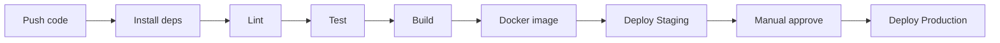

### 18.2 Quality gate

- Lint pass.
- Unit test pass.
- Build pass.
- Migration kiểm tra trước production.
- Không commit secret vào repo.

---

## 19. Environment Variables

| Key | Mục đích |
|---|---|
| `DATABASE_URL` | Kết nối PostgreSQL |
| `REDIS_URL` | Redis cache/rate limit |
| `JWT_SECRET` | Ký JWT nếu dùng JWT |
| `JWT_EXPIRES_IN` | TTL access token |
| `SMTP_HOST` | Email server |
| `SMTP_USER` | Email username |
| `SMTP_PASSWORD` | Email password |
| `S3_ENDPOINT` | Object storage endpoint |
| `S3_BUCKET` | Bucket name |
| `S3_ACCESS_KEY` | Access key |
| `S3_SECRET_KEY` | Secret key |
| `WEBHOOK_URL` | CRM/Zalo/Telegram webhook |
| `RECAPTCHA_SECRET` | Captcha verify key |
| `PUBLIC_SITE_URL` | URL public site |
| `ADMIN_SITE_URL` | URL admin site |

---

## 20. Error Code gợi ý

| Code | Ý nghĩa |
|---|---|
| `VALIDATION_ERROR` | Dữ liệu không hợp lệ |
| `UNAUTHORIZED` | Chưa đăng nhập |
| `FORBIDDEN` | Không có quyền |
| `NOT_FOUND` | Không tìm thấy dữ liệu |
| `DUPLICATE_EMAIL` | Email user đã tồn tại |
| `INVALID_CREDENTIALS` | Sai email hoặc mật khẩu |
| `ACCOUNT_DISABLED` | Tài khoản bị vô hiệu hóa |
| `TOKEN_EXPIRED` | Token hết hạn |
| `TOKEN_INVALID` | Token không hợp lệ |
| `PASSWORD_POLICY_FAILED` | Mật khẩu không đạt policy |
| `RATE_LIMITED` | Gửi request quá nhiều |
| `FILE_TOO_LARGE` | File quá dung lượng |
| `UNSUPPORTED_FILE_TYPE` | File không được hỗ trợ |

---

## 21. Testing Strategy

### 21.1 Unit Test

- Validate form/schema.
- Service xử lý lead.
- Service auth/password.
- Permission guard.
- CMS publish logic.

### 21.2 Integration Test

- Submit lead từ public API.
- Login admin.
- Change password.
- Forgot/reset password.
- CRUD lead.
- CRUD content.
- Upload file.

### 21.3 E2E Test

- User vào landing page → submit form → admin thấy lead.
- Admin cập nhật trạng thái lead → timeline ghi nhận.
- Editor publish tin tức → public page hiển thị.
- Admin tạo user → user kích hoạt → login.
- User quên mật khẩu → reset → login lại.

---

## 22. Backup & Recovery

- Backup PostgreSQL hằng ngày.
- Retention tối thiểu 7–30 ngày tùy yêu cầu.
- Backup object storage nếu dùng self-host MinIO.
- Có quy trình restore staging để kiểm tra backup định kỳ.
- Không lưu backup public không mã hóa.

---

## 23. Migration & Seed Data

### 23.1 Migration

- Dùng Alembic nếu FastAPI/SQLAlchemy.
- Dùng Prisma migration hoặc TypeORM migration nếu Node/NestJS.
- Mỗi thay đổi DB phải có migration versioned.

### 23.2 Seed data

- Tạo Super Admin ban đầu.
- Tạo role mặc định.
- Tạo settings mặc định.
- Tạo FAQ mẫu nếu cần.

---

## 24. MVP Architecture

### 24.1 MVP nên có

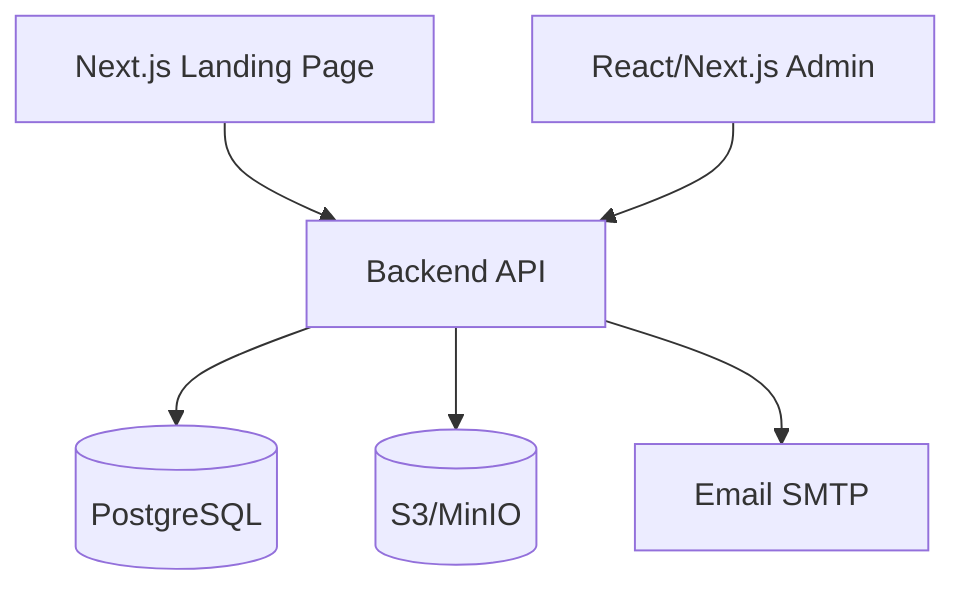

### 24.2 Có thể để Phase 2/3

- Redis cache/rate limit nâng cao.
- Queue worker cho notification.
- Analytics server-side nâng cao.
- CRM integration sâu.
- Multi-language.
- Advanced reporting.

---

## 25. Quy ước triển khai API & dữ liệu

### 25.1 Naming

- Database: snake_case.
- API JSON: camelCase.
- Enum backend: UPPER_SNAKE_CASE.
- Route: kebab-case hoặc plural nouns.

### 25.2 Date/time

- Lưu DB bằng UTC.
- Hiển thị frontend theo timezone Việt Nam.
- API trả ISO 8601.

### 25.3 Soft delete

Nên dùng soft delete cho:

- Lead.
- Content.
- User.
- Media file metadata.

Không hard delete dữ liệu quan trọng nếu chưa có quy trình rõ ràng.

---

## 26. Kết luận kiến trúc

Kiến trúc đề xuất ưu tiên **đơn giản nhưng đủ mở rộng**:

- Public landing page tối ưu SEO/performance.
- Admin dashboard quản trị lead và CMS.
- Backend API module hóa theo domain.
- PostgreSQL là nguồn dữ liệu chính.
- Object storage cho ảnh/file.
- Email/webhook cho thông báo và tích hợp.
- RBAC + audit log + password flows để đảm bảo an toàn cho hệ thống nội bộ.

Với MVP, team có thể bắt đầu bằng monolith backend có module rõ ràng, sau đó tách service hoặc thêm queue/cache khi nhu cầu vận hành tăng.
