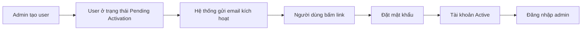
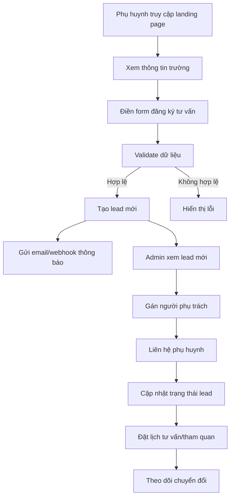
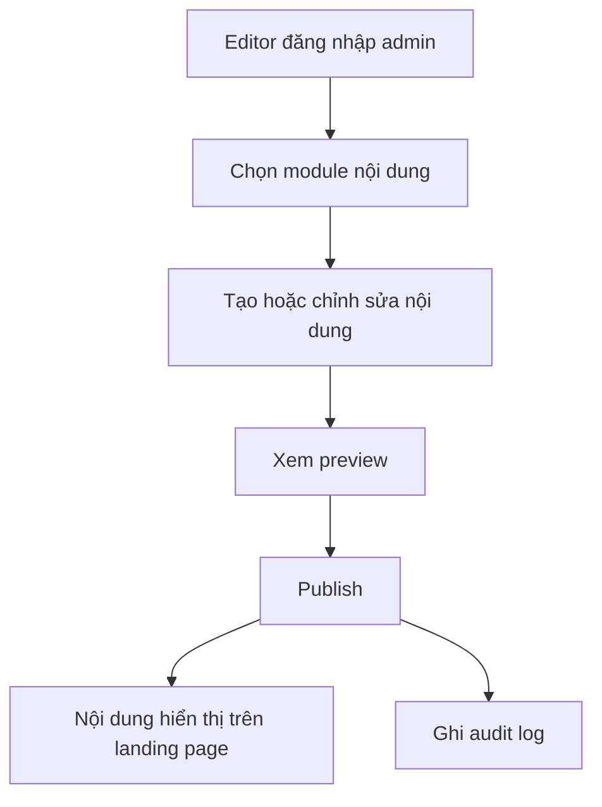

# PRD — WEBSITE LANDING PAGE + ADMIN DASHBOARD TRƯỜNG THPT

> **Product Requirements Document** cho hệ thống website trường THPT gồm **Landing Page public** và **Admin Dashboard quản trị tuyển sinh/nội dung**.

---

## 1. Thông tin tài liệu

| Trường | Nội dung |
|---|---|
| Tên sản phẩm | Website Landing Page + Admin Dashboard trường THPT |
| Loại tài liệu | PRD / Product Requirements Document |
| Phiên bản | v1.0 |
| Đối tượng sử dụng tài liệu | Product Owner, BA, UI/UX Designer, FE, BE, QA, DevOps, Ban tuyển sinh |
| Mục tiêu | Làm rõ bài toán, phạm vi, người dùng, chức năng, luồng nghiệp vụ, tiêu chí nghiệm thu |

---

## 2. Bối cảnh & vấn đề cần giải quyết

Trường THPT cần một hệ thống website phục vụ **tuyển sinh và truyền thông thương hiệu**, đồng thời có một **admin dashboard nội bộ** để quản lý lead tuyển sinh, lịch hẹn, nội dung website và thông tin vận hành.

Hiện tại, nếu chỉ có landing page tĩnh, nhà trường sẽ gặp các vấn đề:

- Phụ huynh đăng ký tư vấn nhưng không có quy trình chăm sóc rõ ràng.
- Lead bị thất lạc hoặc quản lý thủ công qua Excel/Zalo.
- Không theo dõi được trạng thái xử lý lead.
- Không đo được nguồn lead và hiệu quả chiến dịch tuyển sinh.
- Muốn đổi banner/tin tức/FAQ/giáo viên lại phải nhờ developer.

Hệ thống cần giải quyết đồng thời 2 mục tiêu:

1. **Public website:** giới thiệu trường và thu hút phụ huynh/học sinh đăng ký tư vấn.
2. **Admin dashboard:** giúp nhà trường quản lý lead, lịch hẹn và nội dung website một cách chủ động.

---

## 3. Mục tiêu sản phẩm

### 3.1 Mục tiêu kinh doanh

- Tăng số lượng phụ huynh/học sinh đăng ký tư vấn tuyển sinh.
- Nâng cao hình ảnh thương hiệu trường THPT.
- Chuẩn hóa quy trình tiếp nhận, phân công và chăm sóc lead.
- Giảm phụ thuộc vào developer khi cập nhật nội dung website.
- Theo dõi hiệu quả tuyển sinh qua dashboard, báo cáo và tracking.

### 3.2 Mục tiêu người dùng

| Nhóm người dùng | Mục tiêu |
|---|---|
| Phụ huynh | Tìm hiểu trường, chương trình học, học phí, hồ sơ, đăng ký tư vấn nhanh |
| Học sinh | Xem môi trường học tập, CLB, hoạt động, cơ sở vật chất |
| Cán bộ tuyển sinh | Nhận lead, gọi tư vấn, cập nhật trạng thái, đặt lịch tham quan |
| Editor nội dung | Cập nhật tin tức, banner, FAQ, gallery, giáo viên |
| Admin/Super Admin | Quản lý người dùng, phân quyền, cấu hình hệ thống, theo dõi báo cáo |

---

## 4. KPI / chỉ số thành công

| Nhóm KPI | Chỉ số đề xuất |
|---|---|
| Conversion | Tỷ lệ submit form tư vấn trên tổng lượt truy cập |
| Lead | Số lead mới theo ngày/tuần/tháng |
| Tuyển sinh | Tỷ lệ lead chuyển thành đã nộp hồ sơ / đã nhập học |
| Vận hành | Tỷ lệ lead được liên hệ trong 24h |
| Nội dung | Số lượt xem tin tuyển sinh / chương trình học |
| Hiệu năng | Lighthouse desktop >= 90, mobile >= 85 |
| SEO | Có title, description, heading, schema, alt ảnh |

---

## 5. Phạm vi sản phẩm

### 5.1 Trong phạm vi

- Landing page public responsive.
- Form đăng ký tư vấn tuyển sinh.
- Admin dashboard.
- Quản lý lead tuyển sinh.
- Quản lý lịch hẹn tư vấn/tham quan.
- Quản lý tin tức/sự kiện.
- Quản lý banner landing page.
- Quản lý chương trình đào tạo.
- Quản lý giáo viên.
- Quản lý gallery/cơ sở vật chất.
- Quản lý FAQ.
- Quản lý testimonial.
- Quản lý thông tin tuyển sinh.
- Quản lý user và phân quyền.
- Đăng nhập admin, kích hoạt tài khoản, đổi/quên/reset mật khẩu.
- Cấu hình thông tin trường, email, webhook, tracking.
- Audit log thao tác admin.
- API phục vụ public và admin.

### 5.2 Ngoài phạm vi giai đoạn MVP

- Cổng học sinh/phụ huynh sau nhập học.
- Thanh toán học phí online.
- LMS / học trực tuyến.
- Quản lý điểm danh, điểm số, học bạ.
- Tích hợp sâu với hệ thống quản lý giáo dục bên thứ ba.
- Mobile app native.

---

## 6. Persona người dùng

### 6.1 Phụ huynh học sinh lớp 9

**Nhu cầu:**

- Biết trường có uy tín không.
- Xem chương trình học, học phí, hồ sơ tuyển sinh.
- Đăng ký để được tư vấn nhanh.

**Pain point:**

- Thông tin tuyển sinh phân tán.
- Không biết liên hệ ai.
- Lo ngại môi trường học tập, chất lượng giáo viên, đầu ra.

### 6.2 Học sinh chuẩn bị vào lớp 10

**Nhu cầu:**

- Xem ảnh trường, hoạt động, CLB.
- Biết trường có môi trường năng động không.
- Biết định hướng học tập và cơ hội phát triển.

### 6.3 Cán bộ tuyển sinh

**Nhu cầu:**

- Xem lead mới.
- Gọi điện/tư vấn.
- Ghi chú kết quả chăm sóc.
- Đặt lịch hẹn/tham quan.
- Theo dõi trạng thái lead.

### 6.4 Editor nội dung

**Nhu cầu:**

- Tạo/sửa tin tức.
- Cập nhật banner.
- Upload gallery.
- Sửa FAQ, thông tin tuyển sinh.

### 6.5 Admin/Super Admin

**Nhu cầu:**

- Quản lý user và phân quyền.
- Cấu hình hệ thống.
- Theo dõi hoạt động và audit log.
- Kiểm soát bảo mật tài khoản.

---

## 7. Tổng quan module

| Module | Public | Admin | Mục đích |
|---|---:|---:|---|
| Landing Page | Có | Không | Hiển thị thông tin trường và form tư vấn |
| Lead tuyển sinh | Tạo mới từ form | Có | Quản lý phụ huynh/học sinh quan tâm |
| Lịch hẹn | Không | Có | Quản lý lịch tư vấn/tham quan |
| Tin tức/sự kiện | Có | Có | Truyền thông hoạt động trường |
| Banner | Có | Có | Quản lý hero/campaign tuyển sinh |
| Chương trình đào tạo | Có | Có | Giới thiệu khối 10/11/12, hệ đào tạo |
| Giáo viên | Có | Có | Tăng niềm tin với phụ huynh |
| Gallery | Có | Có | Hiển thị cơ sở vật chất/hoạt động |
| FAQ | Có | Có | Trả lời câu hỏi phổ biến |
| Testimonial | Có | Có | Tạo social proof |
| User & Role | Không | Có | Quản lý tài khoản nội bộ |
| Audit Log | Không | Có | Theo dõi thao tác hệ thống |
| Settings | Không | Có | Cấu hình thông tin trường và tích hợp |

---

## 8. Yêu cầu Landing Page Public

### 8.1 Cấu trúc section

| STT | Section | Mục đích |
|---:|---|---|
| 1 | Header / Navigation | Điều hướng nhanh |
| 2 | Hero Banner | Gây ấn tượng đầu tiên, CTA tuyển sinh |
| 3 | Giới thiệu nhanh | Tóm tắt về trường |
| 4 | Lý do chọn trường | Tăng niềm tin |
| 5 | Chương trình đào tạo | Giới thiệu khối/lớp/hệ đào tạo |
| 6 | Thành tích nổi bật | Chứng minh chất lượng |
| 7 | Cơ sở vật chất | Trực quan hóa môi trường học |
| 8 | Đội ngũ giáo viên | Tạo uy tín |
| 9 | Đời sống học sinh | Tạo cảm giác năng động |
| 10 | Quy trình tuyển sinh | Hướng dẫn đăng ký |
| 11 | Tin tức / sự kiện | Cập nhật hoạt động |
| 12 | Cảm nhận phụ huynh/học sinh | Social proof |
| 13 | Form đăng ký tư vấn | Thu lead |
| 14 | FAQ | Giảm câu hỏi lặp lại |
| 15 | Footer | Liên hệ, map, link nhanh |

### 8.2 Header

**Thành phần:** logo, tên trường, menu, nút CTA “Đăng ký tư vấn”.

**Hành vi:**

- Sticky khi scroll.
- Click menu scroll tới section tương ứng.
- Mobile hiển thị hamburger.
- CTA scroll tới form đăng ký.

### 8.3 Hero Banner

**Nội dung:**

- Headline: `Trường THPT [Tên trường]`.
- Sub headline: `Nơi nuôi dưỡng tri thức, nhân cách và tương lai`.
- CTA chính: `Đăng ký tư vấn tuyển sinh`.
- CTA phụ: `Xem chương trình học`.
- Badge: `Tuyển sinh lớp 10 năm học 2026`.

### 8.4 Form đăng ký tư vấn

| Field | Bắt buộc | Ghi chú |
|---|---:|---|
| Họ và tên phụ huynh | Có | Text |
| Số điện thoại | Có | Validate số điện thoại |
| Email | Không | Validate email nếu nhập |
| Họ tên học sinh | Có | Text |
| Năm sinh học sinh | Không | Number/date |
| Lớp hiện tại | Có | Ví dụ: Lớp 9 |
| Khu vực sinh sống | Không | Quận/huyện |
| Nhu cầu tư vấn | Không | Textarea |
| Kênh biết đến trường | Không | Dropdown |
| Đồng ý chính sách bảo mật | Có | Checkbox |

**Trạng thái form:** default, focus, validation error, loading, success, failed.

**Sau khi submit thành công:**

- Hiển thị thông báo cảm ơn.
- Lưu lead vào database.
- Gửi email/webhook nếu được cấu hình.
- Ghi event `submit_admission_form`.

---

## 9. Yêu cầu Admin Dashboard

### 9.1 Layout admin

- Sidebar bên trái.
- Topbar phía trên.
- Breadcrumb.
- Khu vực nội dung chính.
- Notification icon.
- Avatar user.
- Search/filter theo từng module.
- Responsive tối thiểu cho desktop/tablet.

### 9.2 Dashboard tổng quan

Widget cần có:

- Tổng số lead đăng ký.
- Lead mới hôm nay.
- Lead đã liên hệ.
- Lead chờ xử lý.
- Lead đã chuyển đổi nhập học.
- Tỷ lệ chuyển đổi.
- Biểu đồ lead theo ngày/tuần/tháng.
- Biểu đồ nguồn lead.
- Danh sách lead mới nhất.
- Nhắc việc cần xử lý hôm nay.

### 9.3 Quản lý lead tuyển sinh

**Danh sách lead:**

- Search theo tên phụ huynh, tên học sinh, số điện thoại.
- Filter theo trạng thái, nguồn, lớp quan tâm, thời gian đăng ký.
- Sort theo ngày tạo/mức độ ưu tiên.
- Chọn nhiều lead.
- Action hàng loạt: gán người phụ trách, đổi trạng thái, export Excel.

**Cột bảng:**

| Cột | Mô tả |
|---|---|
| Mã lead | ID ngắn |
| Phụ huynh | Tên phụ huynh |
| Số điện thoại | SĐT liên hệ |
| Học sinh | Tên học sinh |
| Lớp hiện tại | Ví dụ Lớp 9 |
| Nhu cầu tư vấn | Nội dung người dùng nhập |
| Nguồn | Website/Facebook/Zalo/Sự kiện |
| Trạng thái | Badge trạng thái |
| Người phụ trách | Nhân sự được gán |
| Ngày đăng ký | Created date |
| Hành động | Xem/sửa/cập nhật |

**Trạng thái lead:**

- Mới.
- Đã liên hệ.
- Không nghe máy.
- Cần gọi lại.
- Đã tư vấn.
- Đã đặt lịch tham quan.
- Đã nộp hồ sơ.
- Đã nhập học.
- Không tiềm năng.

### 9.4 Chi tiết lead

Hiển thị theo page hoặc drawer:

- Thông tin phụ huynh.
- Thông tin học sinh.
- Nhu cầu tư vấn.
- Nguồn lead.
- Trạng thái hiện tại.
- Người phụ trách.
- Timeline lịch sử chăm sóc.
- Ghi chú nội bộ.
- Lịch hẹn gọi lại.
- Lịch tham quan trường.
- File/hồ sơ đính kèm nếu có.
- Action: gọi điện, gửi email, gửi Zalo nếu tích hợp, cập nhật trạng thái.

### 9.5 Quản lý lịch hẹn

- Calendar view ngày/tuần/tháng.
- List view.
- Tạo/sửa/hủy lịch hẹn.
- Gán nhân viên phụ trách.
- Trạng thái: Sắp diễn ra, Hoàn thành, Hủy, Vắng mặt.
- Liên kết với lead.

### 9.6 CMS nội dung

Các module CMS:

- Tin tức/sự kiện.
- Banner landing page.
- Chương trình đào tạo.
- Đội ngũ giáo viên.
- Gallery/cơ sở vật chất.
- FAQ.
- Testimonial.
- Thông tin tuyển sinh.

Các chức năng chung:

- Danh sách.
- Thêm/sửa/xóa.
- Bật/tắt hiển thị.
- Sắp xếp thứ tự.
- Upload ảnh/file.
- Preview nếu là nội dung public.
- Trạng thái Draft/Published/Archived nếu là bài viết.

---

## 10. Quản lý tài khoản admin & mật khẩu

### 10.1 Nguyên tắc

Hệ thống **không cho đăng ký tài khoản admin công khai**. Tài khoản admin chỉ được tạo hoặc mời bởi Super Admin/Admin.

### 10.2 Luồng tạo/kích hoạt tài khoản



### 10.3 Trạng thái tài khoản

- Pending Activation.
- Active.
- Locked.
- Disabled.
- Password Reset Required.

### 10.4 Modal đổi mật khẩu cá nhân

**Vị trí:** Avatar user → Tài khoản của tôi → Đổi mật khẩu.

**Field:**

| Field | Bắt buộc | Validate |
|---|---:|---|
| Mật khẩu hiện tại | Có | Không trống |
| Mật khẩu mới | Có | Theo password policy |
| Xác nhận mật khẩu mới | Có | Trùng mật khẩu mới |

**Password policy:**

- Tối thiểu 8 ký tự.
- Có chữ hoa.
- Có chữ thường.
- Có số.
- Có ký tự đặc biệt.
- Không trùng mật khẩu hiện tại.

### 10.5 Quên mật khẩu

- Màn login có link “Quên mật khẩu?”.
- Người dùng nhập email.
- Hệ thống gửi link reset nếu email tồn tại.
- Dù email có tồn tại hay không, UI hiển thị thông báo chung để tránh lộ tài khoản.

Thông báo chung:

```txt
Nếu email tồn tại trong hệ thống, hướng dẫn đặt lại mật khẩu sẽ được gửi.
```

### 10.6 Reset mật khẩu bởi Admin

Super Admin/Admin có thể gửi email reset mật khẩu cho user khác.

Quy tắc:

- Admin không được xem mật khẩu cũ.
- Admin không tự đặt mật khẩu cho user khác.
- User tự đặt mật khẩu mới qua link email.
- Ghi audit log thao tác reset mật khẩu.

---

## 11. Role & Permission

| Module | Super Admin | Admin | Tuyển sinh | Tư vấn | Editor | Viewer |
|---|---:|---:|---:|---:|---:|---:|
| Dashboard | Full | Full | View | View | View | View |
| Lead | Full | Full | Full | Assigned only | No | View |
| Lịch hẹn | Full | Full | Full | Assigned only | No | View |
| Tin tức | Full | Full | No | No | Full | View |
| Banner | Full | Full | No | No | Full | View |
| Giáo viên | Full | Full | No | No | Full | View |
| Gallery | Full | Full | No | No | Full | View |
| FAQ | Full | Full | No | No | Full | View |
| User/Role | Full | Limited | No | No | No | No |
| Settings | Full | Limited | No | No | No | No |
| Audit log | Full | View | No | No | No | No |

---

## 12. Luồng nghiệp vụ chính

### 12.1 Từ public form tới chăm sóc lead



### 12.2 Cập nhật nội dung public



---

## 13. Data Model mức PRD

### 13.1 AdmissionLead

| Field | Mô tả |
|---|---|
| id | UUID |
| parentName | Tên phụ huynh |
| phone | Số điện thoại |
| email | Email |
| studentName | Tên học sinh |
| studentBirthYear | Năm sinh |
| currentGrade | Lớp hiện tại |
| area | Khu vực |
| message | Nhu cầu tư vấn |
| source | Nguồn lead |
| status | Trạng thái lead |
| assignedTo | Người phụ trách |
| createdAt | Ngày tạo |
| updatedAt | Ngày cập nhật |

### 13.2 Appointment

| Field | Mô tả |
|---|---|
| id | UUID |
| leadId | Lead liên quan |
| title | Tiêu đề lịch hẹn |
| type | Call / Visit / Online |
| startTime | Thời gian bắt đầu |
| endTime | Thời gian kết thúc |
| ownerId | Người phụ trách |
| status | Scheduled / Completed / Cancelled / NoShow |
| note | Ghi chú |

### 13.3 ContentItem

Dùng cho news/banner/program/teacher/gallery/FAQ/testimonial tùy loại.

| Field | Mô tả |
|---|---|
| id | UUID |
| type | Loại nội dung |
| title | Tiêu đề |
| slug | URL slug nếu có |
| summary | Mô tả ngắn |
| content | Nội dung chi tiết |
| thumbnail | Ảnh đại diện |
| status | Draft / Published / Archived |
| sortOrder | Thứ tự hiển thị |
| isVisible | Bật/tắt hiển thị |
| publishedAt | Ngày xuất bản |

---

## 14. API yêu cầu mức PRD

### 14.1 Public API

| Method | Endpoint | Mục đích |
|---|---|---|
| POST | `/api/admission-leads` | Submit form tư vấn |
| GET | `/api/public/news` | Lấy tin tức public |
| GET | `/api/public/homepage` | Lấy nội dung landing page |
| GET | `/api/public/faqs` | Lấy FAQ |

### 14.2 Admin API

| Method | Endpoint | Mục đích |
|---|---|---|
| POST | `/api/admin/auth/login` | Đăng nhập admin |
| POST | `/api/admin/auth/logout` | Đăng xuất |
| POST | `/api/admin/auth/change-password` | Đổi mật khẩu |
| POST | `/api/admin/auth/forgot-password` | Gửi link quên mật khẩu |
| POST | `/api/admin/auth/reset-password` | Đặt lại mật khẩu |
| GET | `/api/admin/dashboard` | Dashboard tổng quan |
| GET | `/api/admin/leads` | Danh sách lead |
| GET | `/api/admin/leads/{id}` | Chi tiết lead |
| PATCH | `/api/admin/leads/{id}` | Cập nhật lead |
| POST | `/api/admin/appointments` | Tạo lịch hẹn |
| GET | `/api/admin/content/{type}` | Danh sách nội dung theo loại |
| POST | `/api/admin/content/{type}` | Tạo nội dung |
| PATCH | `/api/admin/content/{type}/{id}` | Cập nhật nội dung |
| DELETE | `/api/admin/content/{type}/{id}` | Xóa/ẩn nội dung |
| GET | `/api/admin/users` | Danh sách user |
| POST | `/api/admin/users` | Tạo/mời user |
| POST | `/api/admin/users/{id}/send-reset-password` | Gửi email reset mật khẩu |
| GET | `/api/admin/audit-logs` | Xem audit log |

---

## 15. Tracking & Analytics

| Event | Khi trigger |
|---|---|
| view_landing_page | User vào landing page |
| click_register_cta | Click nút đăng ký tư vấn |
| submit_admission_form | Submit form thành công |
| submit_admission_form_failed | Submit form lỗi |
| click_phone | Click hotline |
| click_zalo | Click Zalo |
| click_map | Click Google Map |
| view_program_section | Scroll tới chương trình học |
| view_admission_section | Scroll tới tuyển sinh |
| admin_login | Admin đăng nhập |
| lead_status_updated | Cập nhật trạng thái lead |
| content_published | Publish nội dung CMS |

---

## 16. SEO yêu cầu

- Có meta title, meta description.
- Có H1 duy nhất.
- Section dùng H2 rõ ràng.
- Ảnh có alt text.
- URL thân thiện.
- Có sitemap.xml và robots.txt.
- Có schema `EducationalOrganization` hoặc `LocalBusiness`.
- Tối ưu Core Web Vitals.

Meta title gợi ý:

```txt
Trường THPT [Tên trường] - Tuyển sinh lớp 10 năm học 2026
```

Meta description gợi ý:

```txt
Trường THPT [Tên trường] tuyển sinh lớp 10 với chương trình đào tạo toàn diện, đội ngũ giáo viên tận tâm, cơ sở vật chất hiện đại và môi trường học tập năng động.
```

---

## 17. Bảo mật & tuân thủ

- Validate dữ liệu cả frontend và backend.
- Rate limit form submit.
- reCAPTCHA/hCaptcha cho form public nếu cần.
- Không tiết lộ email admin có tồn tại hay không ở flow quên mật khẩu.
- Token kích hoạt/reset mật khẩu có thời hạn và chỉ dùng một lần.
- Mật khẩu hash bằng thuật toán an toàn.
- Phân quyền theo role.
- Audit log cho thao tác quan trọng.
- Không log dữ liệu nhạy cảm không cần thiết.
- Có checkbox đồng ý chính sách bảo mật khi thu thập thông tin phụ huynh/học sinh.

---

## 18. Hiệu năng

| Tiêu chí | Yêu cầu |
|---|---|
| FCP | < 2s |
| LCP | < 2.5s |
| CLS | < 0.1 |
| Lighthouse Desktop | >= 90 |
| Lighthouse Mobile | >= 85 |
| Image | WebP/AVIF, lazy load |
| API list admin | Có pagination/filter |
| Upload ảnh | Giới hạn dung lượng, validate định dạng |

---

## 19. Acceptance Criteria

### 19.1 Landing Page

| Mã | Điều kiện nghiệm thu |
|---|---|
| AC-LP-01 | Landing page hiển thị đúng trên desktop, tablet, mobile |
| AC-LP-02 | Header sticky hoạt động |
| AC-LP-03 | Menu scroll đúng section |
| AC-LP-04 | CTA đăng ký tư vấn scroll tới form |
| AC-LP-05 | Form validate đầy đủ field bắt buộc |
| AC-LP-06 | Submit thành công tạo lead trong admin |
| AC-LP-07 | Submit lỗi hiển thị message rõ ràng |
| AC-LP-08 | FAQ accordion mở/đóng đúng |
| AC-LP-09 | Gallery hiển thị ảnh và responsive |
| AC-LP-10 | SEO meta, H1, alt ảnh đầy đủ |

### 19.2 Admin Dashboard

| Mã | Điều kiện nghiệm thu |
|---|---|
| AC-AD-01 | Admin đăng nhập thành công với tài khoản hợp lệ |
| AC-AD-02 | User không có quyền không truy cập được module bị hạn chế |
| AC-AD-03 | Dashboard hiển thị số liệu lead đúng |
| AC-AD-04 | Danh sách lead search/filter/sort/pagination đúng |
| AC-AD-05 | Admin cập nhật trạng thái lead thành công |
| AC-AD-06 | Admin gán người phụ trách lead thành công |
| AC-AD-07 | Admin tạo/sửa/hủy lịch hẹn thành công |
| AC-AD-08 | Editor publish nội dung và public page hiển thị đúng |
| AC-AD-09 | User thao tác quan trọng được ghi audit log |
| AC-AD-10 | Export Excel lead hoạt động đúng nếu nằm trong phase triển khai |

### 19.3 Account & Password

| Mã | Điều kiện nghiệm thu |
|---|---|
| AC-PW-01 | User đổi mật khẩu thành công khi nhập đúng mật khẩu hiện tại |
| AC-PW-02 | Không cho đổi nếu mật khẩu hiện tại sai |
| AC-PW-03 | Không cho đổi nếu mật khẩu mới không đạt policy |
| AC-PW-04 | Không cho đổi nếu xác nhận mật khẩu không khớp |
| AC-PW-05 | Quên mật khẩu hiển thị thông báo chung dù email tồn tại hay không |
| AC-PW-06 | Token reset mật khẩu có thời hạn |
| AC-PW-07 | Token đã dùng không dùng lại được |
| AC-PW-08 | Admin có thể gửi email reset mật khẩu cho user |
| AC-PW-09 | Không có đăng ký tài khoản admin công khai |
| AC-PW-10 | Mọi thao tác đổi/reset mật khẩu được ghi audit log |

---

## 20. MVP & Phase triển khai

### Phase 1 — MVP

- Landing page public đầy đủ section chính.
- Form đăng ký tư vấn.
- Admin login.
- Dashboard cơ bản.
- Quản lý lead.
- Quản lý lịch hẹn cơ bản.
- Quản lý tin tức, banner, FAQ.
- Quản lý user/role cơ bản.
- Đổi/quên/reset mật khẩu.
- Audit log cơ bản.

### Phase 2 — CMS mở rộng

- Quản lý giáo viên.
- Quản lý gallery.
- Quản lý chương trình đào tạo.
- Quản lý testimonial.
- Quản lý thông tin tuyển sinh.
- Preview nội dung.
- Upload file brochure.

### Phase 3 — Tích hợp & tối ưu

- Webhook CRM/Zalo/Telegram.
- Email automation.
- Export Excel nâng cao.
- Analytics dashboard nâng cao.
- Đa ngôn ngữ nếu cần.
- Tối ưu SEO và performance.

---

## 21. Rủi ro & lưu ý

| Rủi ro | Ảnh hưởng | Giải pháp |
|---|---|---|
| Spam form tư vấn | Nhiễu dữ liệu lead | Rate limit, captcha, validation |
| Dữ liệu lead bị lộ | Ảnh hưởng bảo mật/thương hiệu | RBAC, audit log, HTTPS, bảo vệ API |
| Nội dung public sai | Ảnh hưởng truyền thông | Draft/preview/publish, phân quyền editor |
| Lead không được chăm sóc kịp | Giảm chuyển đổi | Dashboard nhắc việc, trạng thái, assigned owner |
| Ảnh quá nặng | Website chậm | Nén ảnh, WebP/AVIF, lazy load |

---

## 22. Open Questions

- Có cần công khai học phí không?
- Có cần đa ngôn ngữ không?
- Có dùng Zalo OA/CRM cụ thể nào không?
- Có cần quy trình duyệt bài viết trước khi publish không?
- Có cần phân quyền theo cơ sở/campus nếu trường có nhiều cơ sở không?
- Có cần tích hợp SMS/email tự động cho phụ huynh không?

---

## 23. Kết luận

Sản phẩm cần được thiết kế như một hệ thống tuyển sinh và truyền thông hoàn chỉnh, không chỉ là landing page tĩnh. MVP nên ưu tiên **landing page + form tư vấn + quản lý lead + quản lý nội dung cơ bản + bảo mật tài khoản admin** để tạo giá trị nhanh và đủ dùng cho vận hành thực tế.
