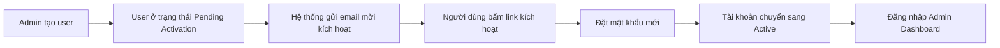
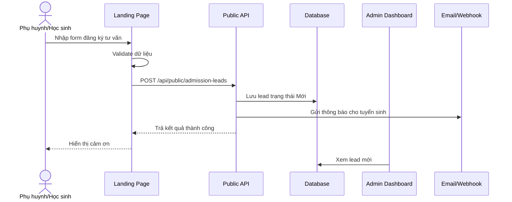
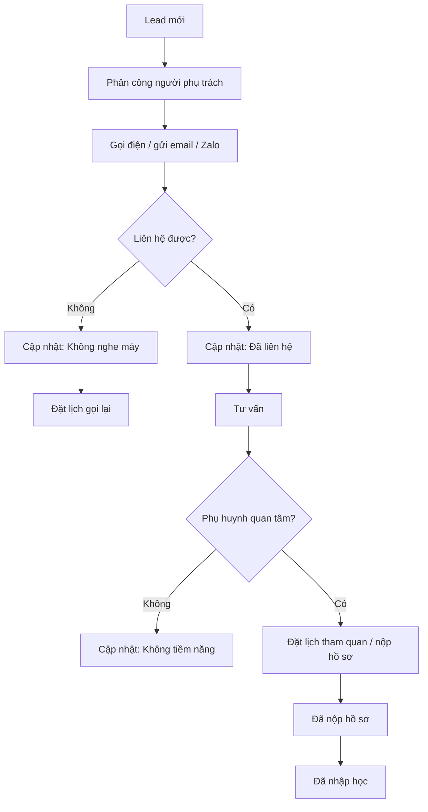

# SPEC WEBSITE LANDING PAGE + ADMIN DASHBOARD TRƯỜNG THPT

> Tài liệu đặc tả chức năng cho hệ thống website trường THPT gồm **Landing Page public** và **Admin Dashboard quản trị tuyển sinh/nội dung**.

---

## 1. Tổng quan

Hệ thống gồm 2 phần chính:

1. **Landing Page Public**  
   Trang giới thiệu trường THPT, chương trình đào tạo, tuyển sinh, cơ sở vật chất, đội ngũ giáo viên, hoạt động học sinh và form đăng ký tư vấn.

2. **Admin Dashboard**  
   Trang quản trị dành cho nhà trường để quản lý lead tuyển sinh, lịch hẹn tư vấn/tham quan, nội dung landing page, tin tức, giáo viên, gallery, FAQ, người dùng và cấu hình hệ thống.

---

## 2. Mục tiêu hệ thống

### 2.1 Mục tiêu kinh doanh

- Tăng số lượng phụ huynh/học sinh đăng ký tư vấn tuyển sinh.
- Tăng độ tin cậy về thương hiệu trường.
- Giới thiệu rõ chương trình học, môi trường học tập và thành tích.
- Chuẩn hóa quy trình tiếp nhận và chăm sóc lead tuyển sinh.
- Cho phép nhà trường tự quản trị nội dung mà không phụ thuộc developer.

### 2.2 Mục tiêu người dùng

- Phụ huynh dễ tìm thông tin tuyển sinh, học phí, hồ sơ, chương trình học.
- Học sinh dễ xem môi trường học tập, hoạt động, CLB, cơ sở vật chất.
- Cán bộ tuyển sinh dễ quản lý lead, cập nhật trạng thái, ghi chú và đặt lịch tư vấn.
- Admin dễ cập nhật nội dung hiển thị ngoài landing page.

---

## 3. Đối tượng sử dụng

### 3.1 Public User

| Nhóm người dùng | Nhu cầu chính |
|---|---|
| Phụ huynh học sinh lớp 9 | Tìm hiểu trường, học phí, chương trình, đăng ký tư vấn |
| Học sinh chuẩn bị vào lớp 10 | Xem môi trường học tập, CLB, hoạt động học sinh |
| Cựu học sinh / đối tác | Xem thông tin trường, tin tức, liên hệ |

### 3.2 Admin User

| Vai trò | Mô tả |
|---|---|
| Super Admin | Toàn quyền hệ thống |
| Admin | Quản lý nội dung, lead, cấu hình cơ bản |
| Cán bộ tuyển sinh | Quản lý lead, lịch hẹn, chăm sóc phụ huynh |
| Nhân viên tư vấn | Xem và cập nhật lead được giao |
| Editor nội dung | Quản lý tin tức, banner, gallery, FAQ |
| Viewer | Chỉ xem báo cáo/dữ liệu, không chỉnh sửa |

---

## 4. Phạm vi hệ thống

### 4.1 Trong phạm vi

- Landing page public responsive.
- Form đăng ký tư vấn tuyển sinh.
- Admin dashboard.
- Quản lý lead tuyển sinh.
- Quản lý lịch hẹn tư vấn/tham quan.
- Quản lý tin tức/sự kiện.
- Quản lý banner landing page.
- Quản lý chương trình đào tạo.
- Quản lý giáo viên.
- Quản lý gallery/cơ sở vật chất.
- Quản lý FAQ.
- Quản lý testimonial.
- Quản lý thông tin tuyển sinh.
- Quản lý user và phân quyền.
- Cấu hình thông tin trường, email, webhook, tracking.
- Audit log thao tác admin.

### 4.2 Ngoài phạm vi MVP

- Thanh toán học phí online.
- Cổng học sinh/phụ huynh.
- Quản lý điểm số/học bạ.
- LMS/e-learning.
- App mobile riêng.
- Tích hợp sâu với hệ thống quản lý học sinh hiện hữu.

---

## 5. Cấu trúc Landing Page Public

Landing page gồm các section theo thứ tự:

| STT | Section | Mục đích |
|---:|---|---|
| 1 | Header / Navigation | Điều hướng nhanh |
| 2 | Hero Banner | Gây ấn tượng đầu tiên |
| 3 | Giới thiệu nhanh | Tóm tắt về trường |
| 4 | Lý do chọn trường | Tăng niềm tin |
| 5 | Chương trình đào tạo | Giới thiệu khối/lớp/hệ đào tạo |
| 6 | Thành tích nổi bật | Chứng minh năng lực |
| 7 | Cơ sở vật chất | Tạo cảm giác chuyên nghiệp |
| 8 | Đội ngũ giáo viên | Tăng độ tin cậy |
| 9 | Đời sống học sinh | Cho thấy môi trường năng động |
| 10 | Quy trình tuyển sinh | Hướng dẫn đăng ký |
| 11 | Tin tức / sự kiện | Cập nhật hoạt động |
| 12 | Cảm nhận phụ huynh/học sinh | Social proof |
| 13 | Form đăng ký tư vấn | Thu lead |
| 14 | FAQ | Trả lời câu hỏi phổ biến |
| 15 | Footer | Thông tin liên hệ |

---

## 6. Chi tiết Landing Page Public

### 6.1 Header / Navigation

#### Thành phần UI

- Logo trường.
- Tên trường.
- Menu:
  - Giới thiệu
  - Chương trình học
  - Tuyển sinh
  - Hoạt động học sinh
  - Tin tức
  - Liên hệ
- CTA: `Đăng ký tư vấn` hoặc `Tuyển sinh lớp 10`.

#### Hành vi

- Header sticky khi scroll.
- Click menu scroll đến section tương ứng.
- Mobile dùng hamburger menu.
- CTA scroll đến form đăng ký tư vấn.

---

### 6.2 Hero Banner

#### Mục tiêu

Tạo ấn tượng đầu tiên và truyền tải thông điệp chính của trường.

#### Nội dung đề xuất

- Headline: `Trường THPT [Tên trường]`
- Sub headline: `Nơi nuôi dưỡng tri thức, nhân cách và tương lai`
- CTA chính: `Đăng ký tư vấn tuyển sinh`
- CTA phụ: `Xem chương trình học`
- Badge: `Tuyển sinh lớp 10 năm học 2026`

#### UI

- Ảnh/video background về trường, học sinh, lớp học.
- Có overlay nhẹ để chữ dễ đọc.
- Có thể hiển thị số liệu nhanh: `20+ năm`, `1.500+ học sinh`, `100+ giáo viên`.

---

### 6.3 Giới thiệu nhanh về trường

#### Nội dung

- Lịch sử hình thành.
- Sứ mệnh.
- Tầm nhìn.
- Giá trị cốt lõi.
- Quy mô trường.

#### Số liệu nổi bật

| Chỉ số | Ví dụ |
|---|---:|
| Năm thành lập | 2005 |
| Học sinh | 1.500+ |
| Giáo viên | 100+ |
| Tỷ lệ tốt nghiệp | 98% |
| CLB học sinh | 20+ |

---

### 6.4 Lý do chọn trường

Thiết kế dạng 6 card:

1. Chương trình học toàn diện.
2. Giáo viên tận tâm.
3. Môi trường học tập an toàn.
4. Cơ sở vật chất hiện đại.
5. Hoạt động ngoại khóa đa dạng.
6. Định hướng tương lai rõ ràng.

---

### 6.5 Chương trình đào tạo

#### Nhóm nội dung

| Nhóm | Nội dung |
|---|---|
| Khối 10 | Làm quen THPT, củng cố nền tảng, định hướng tổ hợp |
| Khối 11 | Nâng cao kiến thức, bồi dưỡng năng lực, hướng nghiệp |
| Khối 12 | Ôn thi tốt nghiệp, đại học, tư vấn ngành/trường |
| Hệ chuẩn | Theo chương trình Bộ GD&ĐT |
| Hệ chất lượng cao | Tăng cường ngoại ngữ, STEM, kỹ năng mềm |
| Lớp chuyên đề | Toán, Văn, Anh, Lý, Hóa, Sinh, Tin nếu có |

#### UI

- Dạng tab hoặc card.
- Mỗi chương trình có mô tả ngắn, điểm nổi bật, CTA tìm hiểu thêm.

---

### 6.6 Thành tích nổi bật

#### Nội dung

- Tỷ lệ tốt nghiệp THPT.
- Tỷ lệ đỗ đại học.
- Giải học sinh giỏi.
- Thành tích STEM, thể thao, nghệ thuật.
- Chứng chỉ ngoại ngữ nếu có.

#### UI

- Counter number.
- Card thành tích.
- Timeline thành tựu theo năm nếu cần.

---

### 6.7 Cơ sở vật chất

#### Nhóm ảnh

- Phòng học.
- Phòng thí nghiệm.
- Thư viện.
- Phòng tin học.
- Sân thể thao.
- Căng tin.
- Ký túc xá nếu có.

#### Hành vi

- Gallery dạng grid/carousel.
- Click ảnh mở lightbox.
- Mobile hiển thị carousel.

---

### 6.8 Đội ngũ giáo viên

Mỗi giáo viên hiển thị:

- Ảnh đại diện.
- Họ tên.
- Bộ môn.
- Học vị.
- Số năm kinh nghiệm.
- Thành tích nổi bật.
- Mô tả ngắn.

---

### 6.9 Đời sống học sinh

Nội dung:

- CLB học thuật.
- CLB thể thao.
- CLB nghệ thuật.
- Hoạt động tình nguyện.
- Ngày hội hướng nghiệp.
- Sự kiện truyền thống.
- Chuyến đi trải nghiệm.

---

### 6.10 Quy trình tuyển sinh

| Bước | Nội dung |
|---:|---|
| 1 | Đăng ký thông tin tư vấn |
| 2 | Nhà trường liên hệ xác nhận |
| 3 | Tư vấn / tham quan trường |
| 4 | Nộp hồ sơ tuyển sinh |
| 5 | Xét tuyển / kiểm tra đầu vào nếu có |
| 6 | Nhận kết quả và hoàn tất nhập học |

---

### 6.11 Tin tức / sự kiện

Mỗi bài viết gồm:

- Thumbnail.
- Tiêu đề.
- Ngày đăng.
- Mô tả ngắn.
- Category/tag.
- Link chi tiết.

Category đề xuất:

- Tuyển sinh.
- Hoạt động học sinh.
- Thành tích.
- Thông báo.
- Sự kiện.

---

### 6.12 Cảm nhận phụ huynh / học sinh

Mỗi testimonial gồm:

- Ảnh đại diện.
- Họ tên.
- Vai trò.
- Nội dung cảm nhận.
- Rating nếu có.

---

### 6.13 Form đăng ký tư vấn

| Field | Bắt buộc | Ghi chú |
|---|---|---|
| Họ và tên phụ huynh | Có | Text |
| Số điện thoại | Có | Validate số điện thoại |
| Email | Không | Validate email nếu nhập |
| Họ tên học sinh | Có | Text |
| Năm sinh học sinh | Không | Number/date |
| Lớp hiện tại | Có | Ví dụ: lớp 9 |
| Khu vực sinh sống | Không | Tỉnh/thành, quận/huyện |
| Nhu cầu tư vấn | Không | Textarea |
| Kênh biết đến trường | Không | Dropdown |
| Đồng ý chính sách bảo mật | Có | Checkbox |

#### Trạng thái form

- Default.
- Focus.
- Error validation.
- Loading.
- Submit success.
- Submit failed.

#### Sau khi submit thành công

- Lưu lead vào database.
- Gửi email thông báo cho phòng tuyển sinh.
- Gửi webhook nếu có cấu hình.
- Hiển thị message thành công cho người dùng.

---

### 6.14 FAQ

Câu hỏi gợi ý:

1. Trường tuyển sinh những khối lớp nào?
2. Hồ sơ nhập học cần chuẩn bị gì?
3. Học phí một năm là bao nhiêu?
4. Trường có xe đưa đón không?
5. Trường có bán trú/nội trú không?
6. Có chương trình học bổng không?
7. Học sinh có được tham gia CLB không?
8. Sau khi đăng ký bao lâu được liên hệ?

---

### 6.15 Footer

- Logo trường.
- Tên đầy đủ của trường.
- Địa chỉ.
- Hotline.
- Email.
- Website.
- Fanpage.
- Google Map embed.
- Giờ làm việc.
- Link nhanh.
- Chính sách bảo mật.

---

## 7. Admin Dashboard

### 7.1 Layout Admin

Admin dashboard cần có:

- Sidebar bên trái.
- Topbar phía trên.
- Breadcrumb.
- Avatar user.
- Notification icon.
- Khu vực nội dung chính.
- Responsive desktop/tablet.

### 7.2 Menu Admin

| Menu | Mô tả |
|---|---|
| Dashboard | Tổng quan dữ liệu |
| Lead tuyển sinh | Quản lý đăng ký tư vấn |
| Lịch hẹn | Quản lý tư vấn/tham quan |
| Tin tức / sự kiện | CMS bài viết |
| Banner | Quản lý hero/banner |
| Chương trình đào tạo | Quản lý nội dung chương trình học |
| Giáo viên | Quản lý đội ngũ giáo viên |
| Gallery | Quản lý ảnh cơ sở vật chất/hoạt động |
| FAQ | Quản lý câu hỏi thường gặp |
| Testimonial | Quản lý cảm nhận |
| Thông tin tuyển sinh | Quản lý chiến dịch tuyển sinh |
| Người dùng | Quản lý user và phân quyền |
| Cấu hình | Cấu hình hệ thống |
| Nhật ký hoạt động | Audit log |

---

## 8. Chi tiết module Admin

### 8.1 Dashboard tổng quan

Widget cần có:

- Tổng số lead.
- Lead mới hôm nay.
- Lead chờ xử lý.
- Lead đã liên hệ.
- Lead đã nộp hồ sơ.
- Lead đã nhập học.
- Tỷ lệ chuyển đổi.
- Biểu đồ lead theo ngày/tuần/tháng.
- Biểu đồ nguồn lead.
- Danh sách lead mới nhất.
- Nhắc việc cần xử lý hôm nay.

---

### 8.2 Quản lý lead tuyển sinh

#### Danh sách lead

Chức năng:

- Search theo tên phụ huynh, tên học sinh, số điện thoại.
- Filter theo trạng thái.
- Filter theo nguồn lead.
- Filter theo lớp hiện tại/lớp quan tâm.
- Filter theo thời gian đăng ký.
- Sort theo ngày tạo, mức độ ưu tiên.
- Pagination.
- Export Excel.
- Gán người phụ trách.
- Cập nhật trạng thái hàng loạt.

#### Cột bảng

| Cột | Mô tả |
|---|---|
| Mã lead | ID/mã ngắn |
| Phụ huynh | Tên phụ huynh |
| Số điện thoại | Hotline liên hệ |
| Học sinh | Tên học sinh |
| Lớp hiện tại | Ví dụ lớp 9 |
| Nhu cầu tư vấn | Nội dung người dùng nhập |
| Nguồn | Website/Facebook/Zalo/Sự kiện |
| Trạng thái | Badge trạng thái |
| Người phụ trách | Staff được giao |
| Ngày đăng ký | Created date |
| Hành động | Xem/sửa/cập nhật |

#### Trạng thái lead

- Mới.
- Đã liên hệ.
- Không nghe máy.
- Cần gọi lại.
- Đã tư vấn.
- Đã đặt lịch tham quan.
- Đã nộp hồ sơ.
- Đã nhập học.
- Không tiềm năng.

---

### 8.3 Chi tiết lead

Hiển thị dạng page hoặc drawer:

- Thông tin phụ huynh.
- Thông tin học sinh.
- Nhu cầu tư vấn.
- Nguồn lead.
- Trạng thái hiện tại.
- Người phụ trách.
- Timeline lịch sử chăm sóc.
- Ghi chú nội bộ.
- Lịch hẹn gọi lại.
- Lịch tham quan trường.
- File/hồ sơ đính kèm nếu có.
- Nút gọi điện.
- Nút gửi email.
- Nút gửi Zalo nếu tích hợp.
- Nút cập nhật trạng thái.

---

### 8.4 Quản lý lịch hẹn tư vấn/tham quan

Chức năng:

- Xem lịch theo ngày/tuần/tháng.
- Tạo lịch hẹn.
- Sửa/hủy lịch hẹn.
- Gán nhân viên phụ trách.
- Liên kết lịch hẹn với lead.
- Trạng thái: Sắp diễn ra, Hoàn thành, Hủy, Vắng mặt.
- Gửi nhắc lịch qua email/webhook nếu có.

---

### 8.5 Quản lý tin tức / sự kiện

Chức năng:

- Danh sách bài viết.
- Thêm/sửa/xóa bài viết.
- Upload thumbnail.
- Quản lý category/tag.
- Rich text/Markdown editor.
- Preview bài viết.
- Publish/unpublish/archive.

Field bài viết:

- Tiêu đề.
- Slug.
- Thumbnail.
- Mô tả ngắn.
- Nội dung.
- Category.
- Tag.
- Trạng thái.
- Ngày xuất bản.
- SEO title.
- SEO description.

---

### 8.6 Quản lý banner landing page

Field:

- Ảnh/video banner.
- Headline.
- Sub headline.
- CTA text.
- CTA link.
- Badge text.
- Trạng thái hiển thị.
- Thứ tự hiển thị.

---

### 8.7 Quản lý chương trình đào tạo

Field:

- Tên chương trình.
- Nhóm chương trình: Khối 10, 11, 12, hệ chuẩn, hệ chất lượng cao.
- Mô tả.
- Môn học nổi bật.
- Điểm khác biệt.
- Ảnh minh họa.
- Thứ tự hiển thị.
- Bật/tắt hiển thị.

---

### 8.8 Quản lý giáo viên

Field:

- Ảnh đại diện.
- Họ tên.
- Bộ môn.
- Học vị.
- Số năm kinh nghiệm.
- Thành tích.
- Mô tả ngắn.
- Thứ tự hiển thị.
- Bật/tắt hiển thị ngoài landing page.

---

### 8.9 Quản lý gallery

Field:

- File ảnh.
- Nhóm ảnh.
- Alt text.
- Caption.
- Thứ tự hiển thị.
- Trạng thái hiển thị.

Nhóm ảnh:

- Phòng học.
- Thư viện.
- Phòng thí nghiệm.
- Sân thể thao.
- Hoạt động học sinh.
- Sự kiện.

---

### 8.10 Quản lý FAQ

Field:

- Câu hỏi.
- Câu trả lời.
- Nhóm FAQ.
- Thứ tự hiển thị.
- Trạng thái hiển thị.

---

### 8.11 Quản lý testimonial

Field:

- Họ tên.
- Vai trò.
- Ảnh đại diện.
- Nội dung cảm nhận.
- Rating.
- Thứ tự hiển thị.
- Trạng thái hiển thị.

---

### 8.12 Quản lý thông tin tuyển sinh

Field:

- Năm học tuyển sinh.
- Đối tượng tuyển sinh.
- Chỉ tiêu.
- Thời gian nhận hồ sơ.
- Hồ sơ cần chuẩn bị.
- Học phí dự kiến.
- Chính sách học bổng.
- Nội dung thông báo tuyển sinh.
- File brochure PDF.
- Trạng thái chiến dịch tuyển sinh.

---

### 8.13 Quản lý người dùng & phân quyền

Chức năng:

- Danh sách user.
- Thêm/sửa user.
- Gán vai trò.
- Khóa/mở khóa tài khoản.
- Gửi email mời kích hoạt tài khoản.
- Reset mật khẩu bằng email reset link.
- Xem lịch sử đăng nhập.
- Xem trạng thái bảo mật tài khoản.

#### 8.13.1 Đăng ký / kích hoạt tài khoản admin

Hệ thống admin **không cho phép đăng ký tài khoản công khai** từ màn hình login. Tài khoản admin là tài khoản nội bộ, chỉ được tạo bởi người có quyền.

Cách tạo tài khoản:

1. **Super Admin/Admin tạo trực tiếp user** trong module quản lý người dùng.
2. **Super Admin/Admin gửi email mời kích hoạt** để người dùng tự đặt mật khẩu.

Luồng kích hoạt tài khoản:



Field khi tạo user:

| Field | Bắt buộc | Ghi chú |
|---|---:|---|
| Họ tên | Có | Tên nhân sự nội bộ |
| Email | Có | Dùng để đăng nhập và nhận email kích hoạt |
| Số điện thoại | Không | Phục vụ liên hệ nội bộ |
| Vai trò | Có | Super Admin/Admin/Tuyển sinh/Tư vấn/Editor/Viewer |
| Trạng thái | Có | Pending Activation/Active/Locked/Disabled |
| Gửi email kích hoạt | Không | Checkbox gửi email ngay sau khi tạo |

Trạng thái tài khoản:

| Trạng thái | Ý nghĩa |
|---|---|
| Pending Activation | Tài khoản đã được tạo nhưng chưa đặt mật khẩu |
| Active | Tài khoản đang hoạt động |
| Locked | Tài khoản bị khóa tạm thời |
| Disabled | Tài khoản bị vô hiệu hóa |
| Password Reset Required | Người dùng cần đặt lại mật khẩu trước khi tiếp tục sử dụng |

Quy tắc:

- Không hiển thị nút `Đăng ký tài khoản admin` trên màn hình login.
- Link kích hoạt tài khoản có thời hạn sử dụng.
- Link kích hoạt chỉ dùng được một lần.
- Người dùng chưa kích hoạt không được đăng nhập.
- Mọi thao tác tạo user, gửi lời mời, khóa/mở khóa user phải ghi audit log.

#### 8.13.2 Modal đổi mật khẩu cá nhân

Vị trí mở modal:

```txt
Avatar user → Tài khoản của tôi → Đổi mật khẩu
```

Hoặc:

```txt
Account Settings → Security → Change Password
```

UI modal:

```txt
[Modal] Đổi mật khẩu

Mật khẩu hiện tại *
[________________]

Mật khẩu mới *
[________________]

Xác nhận mật khẩu mới *
[________________]

Yêu cầu mật khẩu:
- Tối thiểu 8 ký tự
- Có chữ hoa, chữ thường
- Có số
- Có ký tự đặc biệt

[Hủy] [Cập nhật mật khẩu]
```

Field và validation:

| Field | Bắt buộc | Validate |
|---|---:|---|
| Mật khẩu hiện tại | Có | Không được trống, phải đúng mật khẩu hiện tại |
| Mật khẩu mới | Có | Đạt password policy |
| Xác nhận mật khẩu mới | Có | Phải trùng mật khẩu mới |

Hành vi:

- Nếu mật khẩu hiện tại sai, hiển thị lỗi tại field.
- Nếu mật khẩu mới không đạt policy, hiển thị danh sách điều kiện chưa đạt.
- Nếu xác nhận mật khẩu không khớp, hiển thị lỗi tại field xác nhận.
- Sau khi đổi mật khẩu thành công, hiển thị toast thành công.
- Tùy cấu hình bảo mật, hệ thống có thể yêu cầu đăng nhập lại.
- Ghi audit log cho thao tác đổi mật khẩu.

#### 8.13.3 Quên mật khẩu admin

Màn hình login admin có link:

```txt
Quên mật khẩu?
```

UI màn hình quên mật khẩu:

```txt
Quên mật khẩu

Nhập email tài khoản admin của bạn.
Hệ thống sẽ gửi link đặt lại mật khẩu nếu email tồn tại.

Email *
[________________]

[Gửi link đặt lại mật khẩu]

[Quay lại đăng nhập]
```

Quy tắc bảo mật:

- Dù email có tồn tại hay không, hệ thống vẫn hiển thị thông báo chung:

```txt
Nếu email tồn tại trong hệ thống, hướng dẫn đặt lại mật khẩu sẽ được gửi.
```

- Không hiển thị thông báo kiểu `Email không tồn tại` để tránh lộ danh sách tài khoản admin.
- Link reset mật khẩu có thời hạn sử dụng.
- Token reset chỉ dùng được một lần.
- Token đã dùng hoặc hết hạn phải bị vô hiệu hóa.

#### 8.13.4 Màn hình đặt lại mật khẩu

URL ví dụ:

```txt
/admin/reset-password?token=xxxx
```

UI màn hình:

```txt
Đặt lại mật khẩu

Mật khẩu mới *
[________________]

Xác nhận mật khẩu mới *
[________________]

[Đặt lại mật khẩu]
```

Hành vi:

- Token hợp lệ: cho phép đặt mật khẩu mới.
- Token hết hạn: báo lỗi và cho phép gửi lại link.
- Token đã dùng: báo lỗi và không cho đặt lại.
- Sau khi đặt lại mật khẩu thành công: chuyển về màn hình login.
- Ghi audit log cho thao tác reset mật khẩu thành công.

#### 8.13.5 Admin reset mật khẩu cho user khác

Dành cho Super Admin/Admin trong module quản lý người dùng.

Vị trí:

```txt
Quản lý người dùng → Chi tiết user → Reset mật khẩu
```

UI modal:

```txt
[Modal] Reset mật khẩu người dùng

Bạn có chắc muốn reset mật khẩu cho tài khoản này?

Người dùng: Nguyễn Văn A
Email: user@school.edu.vn
Vai trò: Cán bộ tuyển sinh

Sau khi xác nhận, hệ thống sẽ gửi email đặt lại mật khẩu cho người dùng.

[Hủy] [Gửi email reset mật khẩu]
```

Quy tắc:

- Admin không được xem mật khẩu hiện tại của user.
- Admin không nên tự đặt mật khẩu mới cho user khác.
- Hệ thống gửi email để user tự đặt lại mật khẩu.
- Mọi thao tác reset mật khẩu bởi admin phải ghi audit log.

---

### 8.14 Cấu hình hệ thống

Cấu hình:

- Tên trường.
- Logo.
- Màu thương hiệu.
- Hotline.
- Email.
- Địa chỉ.
- Fanpage.
- Google Map embed.
- SMTP email.
- Webhook CRM.
- Webhook Zalo/Telegram.
- Google Analytics.
- Meta Pixel.
- reCAPTCHA key.

---

### 8.15 Nhật ký hoạt động

Ghi nhận:

- User thao tác.
- Module thao tác.
- Hành động: tạo/sửa/xóa/cập nhật trạng thái/export.
- Dữ liệu trước/sau nếu cần.
- Thời gian thao tác.
- IP/device nếu cần.

---

## 9. Phân quyền

| Chức năng | Super Admin | Admin | Tuyển sinh | Tư vấn | Editor | Viewer |
|---|---|---|---|---|---|---|
| Xem dashboard | Có | Có | Có | Có | Không | Có |
| Quản lý lead | Có | Có | Có | Lead được giao | Không | Xem |
| Export lead | Có | Có | Có | Không | Không | Không |
| Quản lý lịch hẹn | Có | Có | Có | Lead được giao | Không | Xem |
| Quản lý tin tức | Có | Có | Không | Không | Có | Xem |
| Quản lý banner | Có | Có | Không | Không | Có | Xem |
| Quản lý giáo viên | Có | Có | Không | Không | Có | Xem |
| Quản lý gallery | Có | Có | Không | Không | Có | Xem |
| Quản lý FAQ | Có | Có | Không | Không | Có | Xem |
| Quản lý user | Có | Có | Không | Không | Không | Không |
| Cấu hình hệ thống | Có | Có hạn chế | Không | Không | Không | Không |
| Xem audit log | Có | Có | Không | Không | Không | Xem |

---

## 10. Data Model đề xuất

### 10.1 AdmissionLead

```json
{
  "id": "uuid",
  "code": "LD-2026-0001",
  "parentName": "Nguyễn Văn A",
  "phone": "0987654321",
  "email": "parent@example.com",
  "studentName": "Nguyễn Văn B",
  "studentBirthYear": 2011,
  "currentGrade": "Lớp 9",
  "area": "Hà Nội",
  "message": "Muốn tư vấn tuyển sinh lớp 10",
  "source": "Website",
  "status": "new",
  "priority": "normal",
  "assignedTo": "user_uuid",
  "createdAt": "2026-06-05T10:00:00+07:00",
  "updatedAt": "2026-06-05T10:00:00+07:00"
}
```

### 10.2 LeadNote

```json
{
  "id": "uuid",
  "leadId": "lead_uuid",
  "content": "Phụ huynh muốn được gọi lại vào 19h",
  "createdBy": "user_uuid",
  "createdAt": "2026-06-05T10:30:00+07:00"
}
```

### 10.3 Appointment

```json
{
  "id": "uuid",
  "leadId": "lead_uuid",
  "title": "Tư vấn tuyển sinh lớp 10",
  "type": "consultation",
  "startTime": "2026-06-08T09:00:00+07:00",
  "endTime": "2026-06-08T09:30:00+07:00",
  "status": "scheduled",
  "assignedTo": "user_uuid",
  "note": "Gọi tư vấn qua điện thoại"
}
```

### 10.4 NewsItem

```json
{
  "id": "uuid",
  "title": "Thông báo tuyển sinh lớp 10 năm học 2026",
  "slug": "thong-bao-tuyen-sinh-lop-10-2026",
  "thumbnail": "/images/news/tuyen-sinh-2026.jpg",
  "summary": "Nhà trường thông báo kế hoạch tuyển sinh lớp 10...",
  "content": "HTML/Markdown content",
  "category": "Tuyển sinh",
  "tags": ["tuyen-sinh", "lop-10"],
  "status": "published",
  "publishedAt": "2026-06-05"
}
```

### 10.5 Teacher

```json
{
  "id": "uuid",
  "name": "Trần Thị B",
  "subject": "Ngữ văn",
  "avatar": "/images/teachers/tran-thi-b.jpg",
  "experienceYears": 12,
  "degree": "Thạc sĩ Giáo dục học",
  "achievement": "Giáo viên dạy giỏi cấp thành phố",
  "description": "Giáo viên có nhiều năm kinh nghiệm ôn thi THPT.",
  "isVisible": true,
  "displayOrder": 1
}
```

---

## 11. API đề xuất

### 11.1 Public API

#### Submit lead

```http
POST /api/public/admission-leads
```

Request:

```json
{
  "parentName": "Nguyễn Văn A",
  "phone": "0987654321",
  "email": "parent@example.com",
  "studentName": "Nguyễn Văn B",
  "studentBirthYear": 2011,
  "currentGrade": "Lớp 9",
  "area": "Hà Nội",
  "message": "Tôi muốn được tư vấn tuyển sinh lớp 10",
  "source": "Website",
  "privacyAccepted": true
}
```

Response:

```json
{
  "success": true,
  "message": "Đăng ký tư vấn thành công"
}
```

#### Lấy nội dung landing page

```http
GET /api/public/landing-page
```

#### Lấy tin tức

```http
GET /api/public/news?limit=6
```

#### Lấy chi tiết tin tức

```http
GET /api/public/news/{slug}
```

---

### 11.2 Admin API

#### Auth

```http
POST /api/admin/auth/login
POST /api/admin/auth/logout
GET /api/admin/auth/me
POST /api/admin/auth/change-password
POST /api/admin/auth/forgot-password
POST /api/admin/auth/reset-password
POST /api/admin/auth/activate-account
POST /api/admin/auth/resend-activation
```

##### Đổi mật khẩu cá nhân

```http
POST /api/admin/auth/change-password
```

Request:

```json
{
  "currentPassword": "OldPassword@123",
  "newPassword": "NewPassword@123",
  "confirmPassword": "NewPassword@123"
}
```

##### Quên mật khẩu

```http
POST /api/admin/auth/forgot-password
```

Request:

```json
{
  "email": "admin@school.edu.vn"
}
```

Response luôn dùng message chung:

```json
{
  "success": true,
  "message": "Nếu email tồn tại trong hệ thống, hướng dẫn đặt lại mật khẩu sẽ được gửi."
}
```

##### Đặt lại mật khẩu bằng token

```http
POST /api/admin/auth/reset-password
```

Request:

```json
{
  "token": "reset_token",
  "newPassword": "NewPassword@123",
  "confirmPassword": "NewPassword@123"
}
```

##### Kích hoạt tài khoản bằng token

```http
POST /api/admin/auth/activate-account
```

Request:

```json
{
  "token": "activation_token",
  "password": "NewPassword@123",
  "confirmPassword": "NewPassword@123"
}
```

#### Lead

```http
GET /api/admin/leads
GET /api/admin/leads/{id}
POST /api/admin/leads
PATCH /api/admin/leads/{id}
PATCH /api/admin/leads/{id}/status
POST /api/admin/leads/{id}/notes
POST /api/admin/leads/export
```

#### Appointment

```http
GET /api/admin/appointments
POST /api/admin/appointments
PATCH /api/admin/appointments/{id}
DELETE /api/admin/appointments/{id}
```

#### CMS

```http
GET /api/admin/news
POST /api/admin/news
PATCH /api/admin/news/{id}
DELETE /api/admin/news/{id}

GET /api/admin/banners
POST /api/admin/banners
PATCH /api/admin/banners/{id}
DELETE /api/admin/banners/{id}

GET /api/admin/teachers
POST /api/admin/teachers
PATCH /api/admin/teachers/{id}
DELETE /api/admin/teachers/{id}
```

#### User Management

```http
GET /api/admin/users
GET /api/admin/users/{id}
POST /api/admin/users
PATCH /api/admin/users/{id}
PATCH /api/admin/users/{id}/status
POST /api/admin/users/{id}/send-activation
POST /api/admin/users/{id}/send-reset-password
GET /api/admin/users/{id}/login-history
```

#### Settings

```http
GET /api/admin/settings
PATCH /api/admin/settings
```

---

## 12. Luồng nghiệp vụ chính

### 12.1 Luồng phụ huynh đăng ký tư vấn



### 12.2 Luồng xử lý lead



---

## 13. SEO

### 13.1 Meta title

```txt
Trường THPT [Tên trường] - Tuyển sinh lớp 10 năm học 2026
```

### 13.2 Meta description

```txt
Trường THPT [Tên trường] tuyển sinh lớp 10 với chương trình đào tạo toàn diện, đội ngũ giáo viên tận tâm, cơ sở vật chất hiện đại và môi trường học tập năng động.
```

### 13.3 Keyword gợi ý

- trường THPT [Tên trường]
- tuyển sinh lớp 10
- trường cấp 3 tại [Khu vực]
- trường trung học phổ thông tốt tại [Khu vực]
- học phí trường THPT [Tên trường]
- chương trình học THPT

### 13.4 Technical SEO

- Có H1 duy nhất.
- Mỗi section có H2 rõ ràng.
- Ảnh có alt text.
- URL thân thiện.
- Có sitemap.xml.
- Có robots.txt.
- Có schema `EducationalOrganization` hoặc `School`.
- Tối ưu Open Graph khi share Facebook/Zalo.

---

## 14. Tracking & Analytics

| Event | Khi nào trigger |
|---|---|
| view_landing_page | Người dùng vào landing page |
| click_register_cta | Click nút đăng ký tư vấn |
| submit_admission_form_success | Gửi form thành công |
| submit_admission_form_failed | Gửi form lỗi |
| click_phone | Click hotline |
| click_zalo | Click Zalo |
| click_map | Click Google Map |
| view_program_section | Scroll đến chương trình học |
| view_admission_section | Scroll đến tuyển sinh |
| admin_login | Admin đăng nhập |
| admin_update_lead_status | Admin cập nhật trạng thái lead |
| admin_export_leads | Admin export lead |

---

## 15. Bảo mật

- Validate dữ liệu cả frontend và backend.
- Sanitize input để tránh XSS.
- Chống spam form bằng reCAPTCHA hoặc rate limit.
- Không log dữ liệu nhạy cảm quá mức.
- Phân quyền API theo vai trò.
- Upload file cần kiểm tra định dạng/kích thước.
- JWT/session cần có thời hạn.
- Admin route bắt buộc xác thực.
- Audit log các thao tác quan trọng.
- Backup database định kỳ.

---

## 16. Hiệu năng

| Tiêu chí | Yêu cầu |
|---|---|
| First Contentful Paint | < 2s |
| Largest Contentful Paint | < 2.5s |
| Cumulative Layout Shift | < 0.1 |
| Lighthouse Desktop | >= 90 |
| Lighthouse Mobile | >= 85 |
| Image | WebP/AVIF, lazy load |
| API public | Response < 500ms với dữ liệu cache |
| Admin table | Có pagination/filter phía server |

---

## 17. Tech Stack đề xuất

### 17.1 Frontend

- React hoặc Next.js.
- TypeScript.
- Tailwind CSS.
- React Hook Form + Zod.
- TanStack Query.
- Swiper cho carousel.
- Recharts/ECharts cho dashboard chart.
- TipTap/CKEditor cho rich text editor.

### 17.2 Backend

- Python FastAPI hoặc Node.js/NestJS.
- PostgreSQL.
- Redis cache nếu cần.
- Object storage: S3/MinIO.
- Email: SMTP/SendGrid/Amazon SES.
- Webhook integration.

### 17.3 Deployment

- Frontend: Vercel/Netlify hoặc Docker.
- Backend: Docker/Kubernetes nếu cần.
- Database: PostgreSQL managed hoặc self-hosted.
- CDN: Cloudflare.
- Storage: S3/MinIO.

---

## 18. Component UI cần thiết kế

### Public Landing

- Header.
- Hero banner.
- CTA button.
- Stats card.
- Program card.
- Achievement counter.
- Teacher card.
- News card.
- Testimonial card.
- Gallery/lightbox.
- FAQ accordion.
- Register form.
- Footer.

### Admin

- Sidebar.
- Topbar.
- Breadcrumb.
- Data table.
- Search input.
- Filter panel.
- Status badge.
- Pagination.
- Modal.
- Drawer.
- Tabs.
- Date picker.
- Calendar.
- Chart.
- File uploader.
- Rich text editor.
- Toast.
- Confirm delete dialog.
- Empty state.
- Loading state.
- Error state.

---

## 19. Acceptance Criteria

### 19.1 Landing Page

- Hiển thị đúng trên desktop, tablet, mobile.
- Header sticky hoạt động.
- Menu scroll đúng section.
- Hero có CTA rõ ràng.
- Form validate đúng field bắt buộc.
- Submit form thành công lưu dữ liệu vào database.
- Submit lỗi hiển thị thông báo rõ ràng.
- Gallery mở lightbox được.
- FAQ mở/đóng được.
- Footer hiển thị đủ thông tin liên hệ.

### 19.2 Admin Dashboard

- Admin đăng nhập được.
- User không có quyền không truy cập được module bị chặn.
- Dashboard hiển thị số liệu lead.
- Danh sách lead có search/filter/sort/pagination.
- Xem chi tiết lead được.
- Cập nhật trạng thái lead được.
- Thêm ghi chú lead được.
- Tạo lịch hẹn được.
- Quản lý tin tức/bài viết được.
- Quản lý banner, giáo viên, gallery, FAQ được.
- Export lead ra Excel được nếu có quyền.
- Audit log ghi nhận thao tác quan trọng.
- Admin không có chức năng đăng ký tài khoản công khai.
- Super Admin/Admin tạo được user và gửi email kích hoạt tài khoản.
- User kích hoạt tài khoản bằng link và đặt mật khẩu được.
- User đổi mật khẩu cá nhân thành công khi nhập đúng mật khẩu hiện tại.
- Không cho đổi mật khẩu nếu mật khẩu hiện tại sai hoặc mật khẩu mới không đạt policy.
- Màn hình quên mật khẩu không tiết lộ email có tồn tại hay không.
- Token reset/kích hoạt tài khoản có thời hạn và chỉ dùng được một lần.
- Admin gửi được email reset mật khẩu cho user khác.
- Mọi thao tác đổi/reset/kích hoạt mật khẩu được ghi audit log.

### 19.3 Hiệu năng & bảo mật

- Landing page Lighthouse desktop >= 90.
- Landing page Lighthouse mobile >= 85.
- API validate dữ liệu đầu vào.
- Form chống spam.
- Upload file giới hạn định dạng và kích thước.
- Admin API yêu cầu xác thực.

---

## 20. MVP & Phase triển khai

### Phase 1 - MVP Public + Lead

- Landing page cơ bản.
- Form đăng ký tư vấn.
- Admin login.
- Dashboard đơn giản.
- Quản lý lead.
- Ghi chú lead.
- Cập nhật trạng thái lead.
- Email/webhook thông báo lead mới.

### Phase 2 - CMS nội dung

- Quản lý tin tức.
- Quản lý banner.
- Quản lý giáo viên.
- Quản lý gallery.
- Quản lý FAQ.
- Quản lý thông tin tuyển sinh.

### Phase 3 - Tuyển sinh nâng cao

- Lịch hẹn tư vấn/tham quan.
- Phân công lead tự động.
- Báo cáo chuyển đổi.
- Export Excel.
- Tích hợp CRM/Zalo/Telegram.
- Tracking analytics nâng cao.

### Phase 4 - Mở rộng

- Đa ngôn ngữ.
- Download brochure.
- Chat tư vấn.
- Tự động nhắc lịch.
- Portal phụ huynh/học sinh nếu cần.

---

## 21. Wireframe text tổng quan

```txt
[PUBLIC LANDING]
Header
Hero
Stats
About
Why Choose Us
Programs
Achievements
Facilities Gallery
Teachers
Student Life
Admission Process
News
Testimonials
Register Form
FAQ
Footer

[ADMIN]
Login
Dashboard
Lead List
Lead Detail
Appointment Calendar
News CMS
Banner CMS
Program CMS
Teacher CMS
Gallery CMS
FAQ CMS
Admission Settings
User Management
System Settings
Audit Logs
```

---

## 22. Prompt thiết kế UI dùng cho AI

```txt
Thiết kế hệ thống giao diện website cho một trường THPT tại Việt Nam, bao gồm 2 phần:

A. Landing page public dành cho phụ huynh/học sinh
B. Admin dashboard dành cho nhà trường quản trị nội dung và lead tuyển sinh

Phong cách tổng thể:
- Chuyên nghiệp, tin cậy, hiện đại, phù hợp môi trường giáo dục THPT.
- Màu chủ đạo: xanh navy, trắng, vàng nhạt.
- Typography rõ ràng, dễ đọc.
- Giao diện responsive cho desktop, tablet, mobile.
- Ưu tiên UX đơn giản, dễ thao tác cho phụ huynh và cán bộ tuyển sinh.

LANDING PAGE PUBLIC gồm:
1. Header sticky với logo, menu, CTA đăng ký tư vấn.
2. Hero banner với ảnh/video trường học, headline lớn, CTA chính/phụ.
3. Giới thiệu trường kèm số liệu nổi bật.
4. Lý do chọn trường dạng 6 card.
5. Chương trình đào tạo dạng tab/card cho khối 10, 11, 12.
6. Thành tích nổi bật dạng counter.
7. Gallery cơ sở vật chất.
8. Đội ngũ giáo viên tiêu biểu.
9. Đời sống học sinh và CLB.
10. Quy trình tuyển sinh dạng timeline.
11. Tin tức/sự kiện.
12. Cảm nhận phụ huynh/học sinh.
13. Form đăng ký tư vấn tuyển sinh.
14. FAQ accordion.
15. Footer với thông tin liên hệ và bản đồ.

ADMIN DASHBOARD gồm:
1. Login admin.
2. Dashboard tổng quan lead, biểu đồ, nhắc việc.
3. Quản lý lead tuyển sinh với table, search, filter, status badge, bulk action.
4. Chi tiết lead dạng page/drawer có timeline, ghi chú, lịch hẹn.
5. Quản lý lịch hẹn tư vấn/tham quan dạng calendar.
6. Quản lý tin tức/sự kiện.
7. Quản lý banner landing page.
8. Quản lý chương trình đào tạo.
9. Quản lý giáo viên.
10. Quản lý gallery/cơ sở vật chất.
11. Quản lý FAQ.
12. Quản lý testimonial.
13. Quản lý thông tin tuyển sinh.
14. Quản lý người dùng và phân quyền.
15. Cấu hình hệ thống.
16. Nhật ký hoạt động.

Yêu cầu output:
- Thiết kế đầy đủ public landing page desktop/mobile.
- Thiết kế đầy đủ admin dashboard.
- Có design system cơ bản.
- Có component states: loading, empty, error, success, confirm delete.
- Có responsive layout.
- UX flow rõ từ phụ huynh đăng ký tư vấn đến admin xử lý lead.
- Giao diện đủ chi tiết để frontend developer build bằng React/Next.js.
```

---

## 23. Ghi chú triển khai

- Nếu chưa có CMS đầy đủ, landing page có thể dùng dữ liệu seed/static trong giai đoạn MVP.
- Nên ưu tiên hoàn thiện luồng lead trước vì đây là phần tạo giá trị tuyển sinh trực tiếp.
- Các phần nội dung như giáo viên, gallery, testimonial có thể làm CMS sau nếu cần rút ngắn thời gian.
- Với trường có nhiều cơ sở, cần bổ sung entity `Campus` và filter theo cơ sở.
- Với nhiều chiến dịch tuyển sinh, cần bổ sung entity `AdmissionCampaign`.

